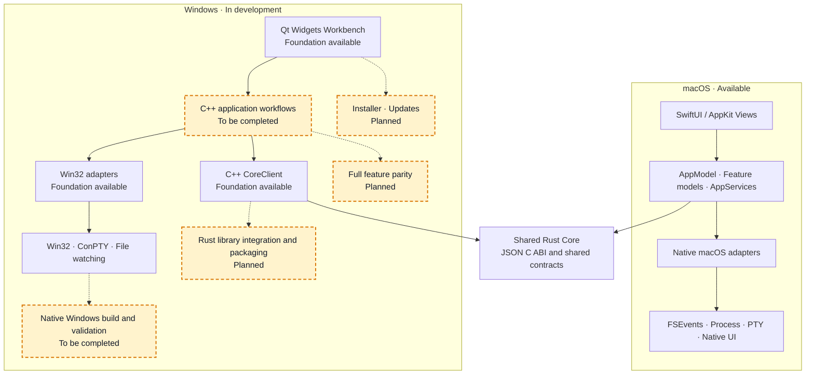

<div align="center">
  

  <h1>Lithe</h1>

  <p><strong>The IDEA-shaped core for AI-assisted development</strong></p>
  <p>Native macOS IDE · familiar workflows · a lighter memory footprint</p>
  <p><em>AI writes the code. Lithe helps you see it, run it, and review it.</em></p>

  <p>
    <a href="./README.zh-CN.md"><strong>简体中文</strong></a> ·
    <a href="#core-capabilities">Core capabilities</a> ·
    <a href="#product-tour">Product tour</a> ·
    <a href="#use-lithe">Use Lithe</a> ·
    <a href="#architecture">Architecture</a> ·
    <a href="#develop-lithe">Develop Lithe</a> ·
    <a href="#contact-us">Contact us</a>
  </p>

  <p>
    <a href="https://github.com/1lck/Lithe-IDEA/releases/latest"></a>
    
    
  </p>
  <p>
    
    
    <a href="./LICENSE"></a>
  </p>

  <p>
    <a href="https://github.com/1lck/Lithe-IDEA/releases/latest"><strong>Download the latest release</strong></a> ·
    <a href="https://github.com/1lck/Lithe-IDEA">View the repository</a>
  </p>
</div>

<table align="center">
  <tr>
    <td align="center">🧭<br><strong>Familiar IDE core</strong><br>Project · Editor · Search · Diff</td>
    <td align="center">⚡<br><strong>Native and on demand</strong><br>SwiftUI/AppKit with services that start when needed</td>
    <td align="center">🤖<br><strong>AI-ready review loop</strong><br>See, run, diff, undo, and commit external changes</td>
    <td align="center">🪶<br><strong>Lighter footprint</strong><br>Keep the resident app small and focused</td>
  </tr>
</table>

<p align="center">
  
</p>

## About Lithe

Lithe is a native macOS IDE built for AI-assisted development. It preserves the project browsing, editing, search, code navigation, Git, run, and debug workflows familiar to IntelliJ IDEA users while starting Java language services, terminals, Maven, and debug processes only when needed.

When an external AI tool changes a project, Lithe helps you locate the affected code, run the project, review the diff, and decide which changes to stage, undo, or commit.

> **A familiar IDE core with a lighter resource footprint.**

## Core capabilities

| Workflow | What Lithe provides |
| --- | --- |
| Project browsing | Welcome screen, recent projects, file tree, file type icons, path breadcrumbs, and workspace restoration |
| Code reading | Native multi-tab editor, basic Java highlighting, code folding, line numbers, saves, and dirty-state tracking |
| Java navigation | Eclipse JDT LS definitions, references, implementations, workspace symbols, and live diagnostics |
| Search | File name, path, full text, Search Everywhere, case/word/regex matching, and project replace |
| External changes | FSEvents watching, create/delete/update refreshes, and disk-versus-editor conflict prompts |
| Git review | Changes, side-by-side diff, diff search, hunk-level stage/revert, commit, shelf, branches, and Git graph |
| Build and run | Maven roots, multimodule projects, profiles, lifecycle, build output, current file, Spring Boot, and Maven module |
| Java debug | Local JDWP, Maven/Spring Boot debug, remote JVM/Tomcat attach, breakpoints, stepping, threads, and variables |
| Productivity | Project-level local history, built-in terminal, draggable tool windows, and restored split layouts |
| Updates | GitHub Release checks, matching artifact validation, confirmed replacement, and restart |
| Interface language | English by default with Simplified Chinese available in Settings |

## Product tour

<p align="center">
  
  
</p>

<p align="center">
  
  
</p>

<p align="center">
  
  
</p>

## Use Lithe

Lithe requires macOS 14 or later. Java project features require a JDK; JDK 17 or JDK 21 is recommended. Semantic navigation requires Eclipse JDT LS. Maven projects need either a project `mvnw` or a system Maven installation.

Download the latest macOS `.dmg` from [GitHub Releases](https://github.com/1lck/Lithe-IDEA/releases/latest). If a release provides architecture-specific installers, choose `arm64` for Apple silicon or `x86_64` for an Intel Mac. Open the disk image, drag `Lithe.app` into `/Applications`, and launch it.

Install Lithe with the project Homebrew tap. The tap verifies the release checksum and clears the macOS quarantine attribute after installation:

```bash
brew tap 1lck/lithe https://github.com/1lck/Lithe-IDEA.git
brew install --cask 1lck/lithe/lithe
```

Update it with:

```bash
brew update
brew upgrade --cask lithe
```

If macOS blocks an app from an unidentified developer, right-click the app and select **Open**, or go to **System Settings → Privacy & Security → Open Anyway**. Only after confirming that the app came from an official Lithe GitHub Release, you can also run:

```bash
xattr -dr com.apple.quarantine "/Applications/Lithe.app"
open "/Applications/Lithe.app"
```

Install JDT LS with Homebrew:

```bash
brew install jdtls
```

After opening a project, use **Settings → Project** to configure the project JDK, Maven, and the JDK used by Maven. Lithe also detects Java and Maven from common system locations.

## Architecture



## Develop Lithe

Development requires Swift 6.2 or later. Running the complete test suite requires Xcode; basic SwiftPM builds only need Command Line Tools.

Run the development build from the repository root:

```bash
./scripts/preview.sh
```

The script builds and links Rust Core before launching the macOS app. To validate only the Swift source, run:

```bash
swift run --disable-sandbox Lithe
```

Build an app bundle:

```bash
./scripts/package-app.sh
open dist/Lithe.app
```

Before submitting a change, run:

```bash
swift test --disable-sandbox
./scripts/verify-core.sh
./scripts/verify-git-graph.sh
./scripts/verify-service-boundaries.sh
./scripts/verify-shared-contracts.sh
./scripts/verify-windows-boundaries.sh
./scripts/verify-rust-core.sh
```

See [Repository layout and shared boundaries](./docs/architecture/repository-layout.md) for directory ownership, cross-platform boundaries, and sharing rules. Include your verification steps and known limitations when submitting a change.

## Project support

### ❤️ Sponsors

<table>
  <tr>
    <td width="112" align="center">
      <a href="https://shu26.cfd/">
        
      </a>
    </td>
    <td>
      <a href="https://shu26.cfd/"><strong>Code GO</strong></a> provides relay access to Claude models and supports the development of Lithe. Thank you to Code GO for supporting this project!
    </td>
  </tr>
  <tr>
    <td width="112" align="center">
      <a href="https://codezsy.com">
        
      </a>
    </td>
    <td>
      <a href="https://codezsy.com"><strong>CodeZ</strong></a> provides relay access to GPT-family models and supports the development of Lithe. Thank you to CodeZ for supporting this project!
    </td>
  </tr>
  <tr>
    <td width="112" align="center">
      <a href="https://www.fastaitoken.com/">
        
      </a>
    </td>
    <td>
      <a href="https://www.fastaitoken.com/"><strong>FastAI</strong></a> provides access to large language models and supports the development of Lithe. Thank you to FastAI for supporting this project!
    </td>
  </tr>
</table>

### ⭐ Special thanks

<p align="center">
  <a href="https://linux.do/">
    
  </a>
</p>

<p align="center">
  <strong>For all things AI, head to LINUX DO. Wishing the community ever greater success.</strong>
</p>

### Contributors

Thank you to everyone who contributes to and improves Lithe.

<a href="https://github.com/1lck/Lithe-IDEA/graphs/contributors">
  
</a>

### License

Lithe is licensed under the [Apache License 2.0](./LICENSE).

## Star History

<a href="https://www.star-history.com/#1lck/Lithe-IDEA&Date">
  <picture>
    <source media="(prefers-color-scheme: dark)" srcset="https://raw.githubusercontent.com/1lck/Lithe-IDEA/chart-assets/star-history-dark.svg" />
    <source media="(prefers-color-scheme: light)" srcset="https://raw.githubusercontent.com/1lck/Lithe-IDEA/chart-assets/star-history-light.svg" />
    
  </picture>
</a>

## Contact us

Join the Lithe-IDEA community group to discuss the project and share feedback, or contact the author directly.

<table align="center">
  <tr>
    <td align="center"><strong>Join the community group</strong></td>
    <td align="center"><strong>Contact the author</strong></td>
  </tr>
  <tr>
    <td align="center"></td>
    <td align="center"></td>
  </tr>
</table>
