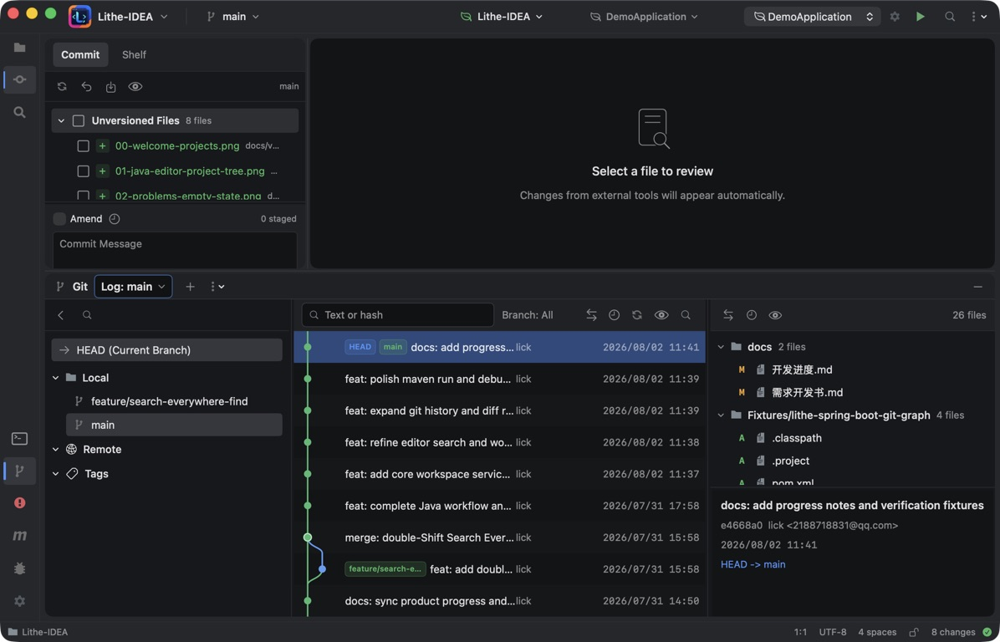

<p align="center">
  
</p>

<h1 align="center">Lithe</h1>

<p align="center">
  <strong>A native macOS workbench for reading, validating, and reviewing AI-generated code</strong>
</p>

<p align="center">
  Let AI produce the code. Let people understand it, verify it, and decide what to keep.
</p>

<p align="center">
  <a href="./README.zh-CN.md">简体中文</a>
</p>

<p align="center">
  <a href="#product-tour">Product Tour</a> ·
  <a href="#quick-start">Quick Start</a> ·
  <a href="#why-lithe">Why Lithe</a> ·
  <a href="#lithe-vs-intellij-idea">Lithe vs IDEA</a>
</p>

<p align="center">
  
  
  
  
</p>

<p align="center">
  
</p>

## Why Lithe

AI is changing how software gets written. More code is now generated, modified, and refactored by AI, while people spend more of their time understanding changes, validating outcomes, and deciding what belongs in the project.

IntelliJ IDEA remains an excellent deep-coding workbench. But after an AI tool changes a project, the immediate job is often much narrower: browse the project, read the changed code, navigate references, inspect the diff, run the result, and accept or undo the change. Starting a full IDE for every review can mean more workspace than the task requires.

Lithe is built for that moment. It watches the same local project directory as external AI tools and puts reading, validation, and Git decisions on one short path.

> **AI produces the code. Lithe helps people understand, verify, and accept it.**

```text
AI changes the project
          ↓
Lithe discovers the changes
          ↓
Browse / Search / Navigate Java
          ↓
Run / Maven / Debug
          ↓
Review the diff → Stage, undo, or commit
```

You do not need to uninstall IntelliJ IDEA or learn a completely new interaction model. Lithe keeps the familiar Project, Changes, Search, Editor, Diff, Run, and Debug concepts, then applies them to an AI-native review workflow.

## Lithe vs IntelliJ IDEA

Lithe is not trying to replace IntelliJ IDEA in every scenario. It replaces the moments in an AI-assisted workflow that need IDE capabilities, but not the weight of a complete IDE.

| Area | IntelliJ IDEA | Lithe |
| --- | --- | --- |
| Primary role | Full Java and multi-language IDE | Workbench for reading, validating, and reviewing AI changes |
| Deep coding | Complete completion, refactoring, plugins, and project tooling | Focused on reading and small manual corrections |
| External AI changes | Possible inside a full IDE workflow | External change detection, conflict prompts, Diff, and Local History are first-class |
| Git workflow | Broad version-control capabilities | Centered on Changes, side-by-side Diff, hunk actions, and accept/undo decisions |
| Java support | Full Java project experience | Eclipse JDT LS navigation, diagnostics, and basic Debug |
| Startup and resources | Broader IDE platform | Native SwiftUI/AppKit with Java services and processes started on demand |
| Familiarity | The established IDEA workflow | Keeps the Project, Changes, Search, Editor, and Diff habits IDEA users already know |

### Moments Lithe can replace IDEA

- An AI tool just changed the project and you need to understand what changed and why.
- You only need project browsing, text search, Java navigation, or a quick code read.
- You want to decide what to keep, undo, stage, commit, or apply at the individual hunk level.
- You need to run Maven, Spring Boot, or a Java file and inspect the result quickly.
- External tools are continuously editing the project and you need Local History and conflict protection.

### Moments IDEA is still the better tool

Deep completion, complex refactoring, automatic imports, a broad plugin ecosystem, multi-language projects, test trees, and coverage remain IDEA strengths. Lithe is not asking you to give those up; it makes the AI-generated-code review loop lighter, faster, and more focused.

## Performance and familiar workflow

### Native, lightweight, and on demand

Lithe is built with SwiftUI and AppKit. It does not embed Chromium or maintain a full IDE-scale resident project model:

- The Java language service starts when a Java project needs it.
- Terminal, Maven, Run, and Debug processes start when you use them.
- Search uses a lightweight disk index, while Local History stores snapshots on disk instead of keeping history text resident in memory.
- Closing a project stops file watchers, language services, terminal sessions, and Run/Debug processes.

On the current development machine, an idle Welcome window uses about **86 MB**. The product targets less than **150 MB** for Welcome and less than **300 MB** for an ordinary project, excluding on-demand child processes. These are development baselines, not a substitute for future stress testing across larger projects.

### No new IDE habits to learn

Lithe follows the IDEA-shaped workflow: Project, Changes, Search, Editor, Diff, Maven, Run, and Debug have corresponding entry points. Familiar actions such as `⌘F` file search, `⌘B` navigation to usages, and double-Shift Search Everywhere remain available.

The cost of switching to Lithe is not learning another IDE. It is simply opening a workbench that is better suited to reading and making decisions after AI has changed the code.

## Product Tour

<p align="center">
  
  
</p>

<p align="center">
  
  
</p>

<p align="center">
  
  
</p>

## Features

| Workflow | What Lithe provides |
| --- | --- |
| Project browsing | Welcome Screen, recent projects, file tree, file icons, breadcrumbs, and workspace state restoration |
| Code reading | Multi-tab native editor, Java syntax highlighting, code folding, line numbers, saving, and dirty-file state |
| Java navigation | Eclipse JDT LS definitions, usages, implementations, workspace symbols, and live diagnostics |
| Search | File name, path, full-text, Search Everywhere, case/whole-word/regex matching, and project replacement |
| External changes | FSEvents monitoring, file refresh, and conflict prompts between disk and unsaved editor content |
| Git review | Changes, side-by-side Diff, Diff search, hunk staging/undo, Commit, Shelf, branches, and Git Graph |
| Build and Run | Maven roots, modules, Profiles, Lifecycle, Build Output, Current File, Spring Boot, and Maven Module configurations |
| Java Debug | Local JDWP, Maven/Spring Boot Debug, Remote JVM/Tomcat attach, breakpoints, stepping, threads, and variables |
| Productivity | Project Local History, integrated terminal, resizable tool windows, and restored split layouts |

## Quick Start

### Requirements

- macOS 14 or later
- Swift 6.2 or later
- A JDK for Java features; JDK 17 or JDK 21 is recommended
- Eclipse JDT LS for Java semantic navigation
- A project `mvnw` or a system Maven installation for Maven projects

Install JDT LS with Homebrew:

```bash
brew install jdtls
```

### Run the development build

From the project root:

```bash
swift run --disable-sandbox Lithe
```

You can also use the preview script:

```bash
./scripts/preview.sh
```

### Build an App Bundle

```bash
./scripts/package-app.sh
open dist/Lithe.app
```

### Check the core workflows

The repository includes UI-independent checks for the core logic:

```bash
./scripts/verify-core.sh
./scripts/verify-git-graph.sh
```

These cover Diff, file visibility, search matching, Git Graph, whitespace filtering, stash, clone, and real Merge/Tag/Remote reference layouts.

## Configure Java and Maven

After opening a project, use **Settings → Project** to configure:

- Project JDK
- Maven Wrapper, system Maven, or a custom Maven Home
- The JDK used by Maven

Lithe discovers installed JDKs by probing `JAVA_HOME`, macOS `java_home`, standard JDK locations, and Homebrew JDKs; Maven is discovered from a project `mvnw`, `MAVEN_HOME`, `PATH`, and standard Homebrew/system locations. The selected runtime is stored per project in local application settings, so machine-specific paths do not enter the repository. These settings are shared by Current File, Maven, Spring Boot, Maven Module, Debug, and JDT LS. A run configuration can still override the project JDK with **JDK Home**.

## Design boundaries

Lithe currently focuses on reading, running, and reviewing Java projects on macOS. It does not include:

- AI model calls, Agent sessions, or chat UI
- LSP and code intelligence for languages other than Java
- Traditional completion, automatic imports, quick fixes, or safe rename
- Test discovery, test trees, coverage, or a full test runner
- Three-way merge conflict resolution, multi-root workspaces, or a plugin marketplace

Current File uses Java source-file mode and is intended for quick single-file examples. For code that depends on other project sources, use a Maven Module or Spring Boot run configuration.

## Technical architecture

```text
SwiftUI Workbench
├── Welcome / Recent Projects
├── Project / Changes / Search
├── Editor Tabs / Diff Review
└── Run / Debug / Maven / Terminal
          ↓
AppKit NSTextView     FSEvents       System Git       JDT LS
Native text editing   File changes   Git review       Java semantics
```

Lithe uses Swift Package Manager and has no third-party Swift Package dependencies:

```text
Sources/Lithe/
├── Models/       Workspace, editor, Git, Java, and run configuration models
├── Services/     Scanning, search, Git, Maven, Java, and Local History
├── Theme/        Lithe visual tokens and icons
└── Views/        Welcome, Workbench, Editor, Diff, and tool windows
```

## Current status

Lithe is in active development. The core loop from opening a project to reading changes, running Java/Maven, reviewing a Diff, and making a Git decision is in place.

| Status | Scope |
| --- | --- |
| Available now | Welcome, project tree, editor, search, external changes, Git/Diff, Local History, terminal, Maven, and basic Run/Debug |
| Being refined | Java navigation edges, cross-file Current File execution, and large-project performance |
| Planned | Automated tests, more Java workflows, and further interaction polish |

## Project structure

```text
Lithe-IDEA/
├── Sources/Lithe/          # SwiftUI / AppKit source
├── Resources/              # Info.plist, app icons, and IDEA-inspired assets
├── Fixtures/               # Maven / Spring Boot examples and Git history fixtures
├── scripts/                # Build, packaging, and core check scripts
├── docs/                   # Supporting documentation and examples
├── Package.swift
├── README.md               # English README
└── README.zh-CN.md         # Simplified Chinese README
```

## Contributing

If you want to contribute:

1. Start with the feature scope and design boundaries above.
2. Run `./scripts/verify-core.sh` and `./scripts/verify-git-graph.sh`.
3. Test UI and runtime behavior in a real Java/Maven project.
4. Include the verification steps and known limitations with your change.

## License

Lithe will be released under an open-source license. A `LICENSE` file and the complete license terms will be added before the public release.
