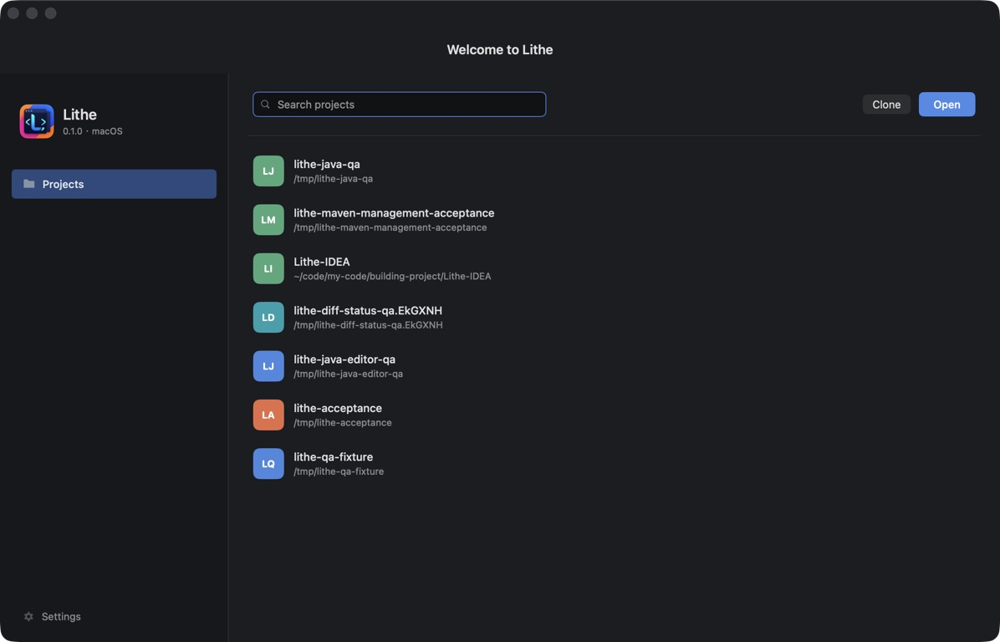
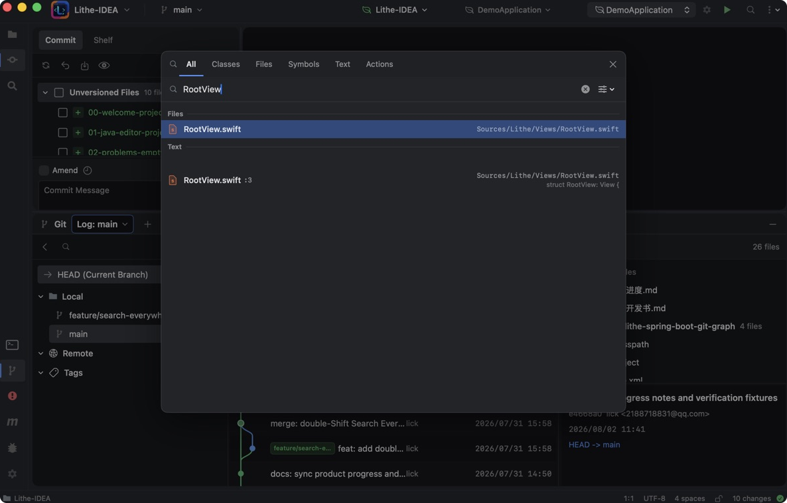
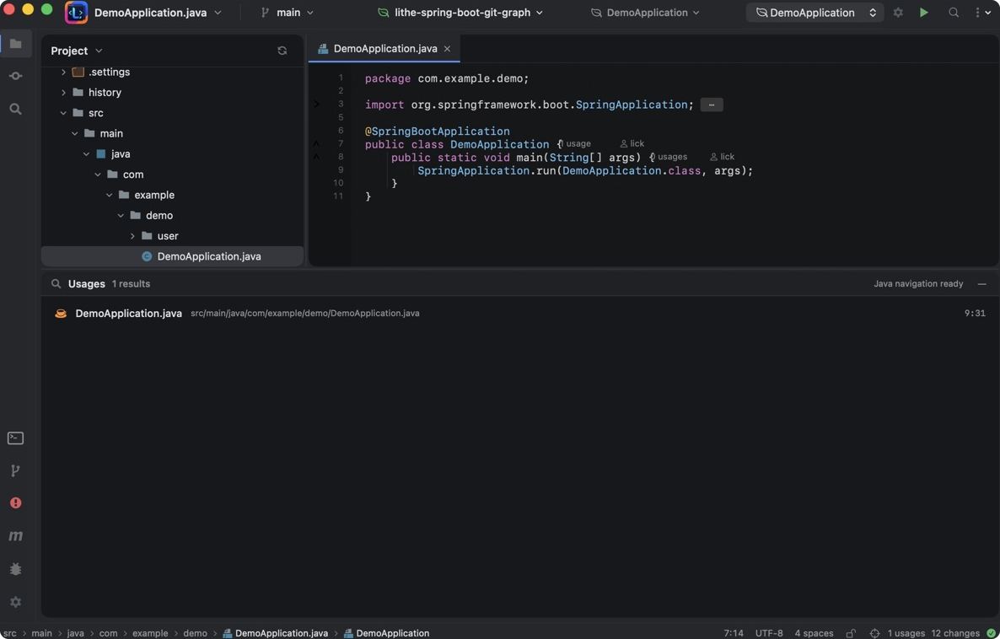
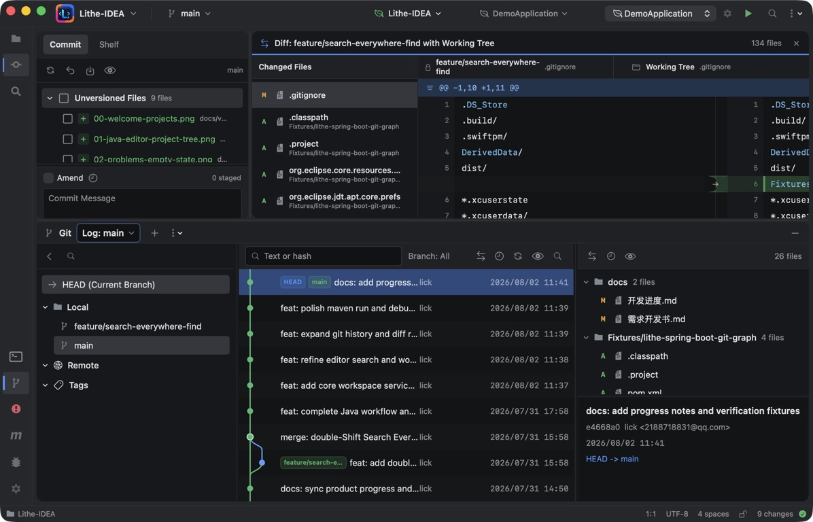
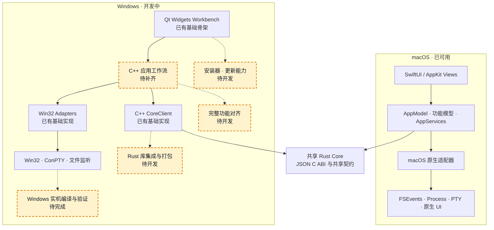

<div align="center">
  

  <h1>Lithe</h1>

  <p><strong>为 AI 辅助开发保留 IDEA 核心习惯</strong></p>
  <p>原生 macOS IDE · 熟悉的操作路径 · 更轻的内存占用</p>
  <p><em>AI 负责大量编写，Lithe 负责让你看得清、跑得通、审得明白。</em></p>

  <p>
    <a href="./README.md"><strong>English</strong></a> ·
    <a href="#核心能力">核心能力</a> ·
    <a href="#产品截图">产品截图</a> ·
    <a href="#如何使用">如何使用</a> ·
    <a href="#架构图">架构图</a> ·
    <a href="#如何开发">如何开发</a> ·
    <a href="#联系我们">联系我们</a>
  </p>

  <p>
    <a href="https://github.com/1lck/Lithe-IDEA/releases/latest"></a>
    
    
  </p>
  <p>
    
    
    <a href="./LICENSE"></a>
  </p>

  <p>
    <a href="https://github.com/1lck/Lithe-IDEA/releases/latest"><strong>下载最新版本</strong></a> ·
    <a href="https://github.com/1lck/Lithe-IDEA">查看 GitHub 仓库</a>
  </p>
</div>

<table align="center">
  <tr>
    <td align="center">🧭<br><strong>熟悉的 IDE 核心</strong><br>Project · Editor · Search · Diff</td>
    <td align="center">⚡<br><strong>原生、按需启动</strong><br>SwiftUI/AppKit，重量级服务需要时才启动</td>
    <td align="center">🤖<br><strong>适配 AI 开发</strong><br>查看、运行、Diff、撤销和提交外部修改</td>
    <td align="center">🪶<br><strong>更轻的资源占用</strong><br>让常驻应用保持小而专注</td>
  </tr>
</table>

<p align="center">
  
</p>

## 项目简介

Lithe 是一款面向 AI 辅助开发的原生 macOS IDE。它保留 IntelliJ IDEA 用户熟悉的项目浏览、编辑、搜索、代码导航、Git、运行和调试工作流，同时让 Java 语言服务、终端、Maven 和调试进程只在需要时启动。

当外部 AI 工具修改项目后，你可以用 Lithe 定位受影响的代码、运行项目、审查 Diff，并决定暂存、撤销或提交哪些修改。

> **熟悉的 IDE 核心体验，更轻的资源占用。**

## 核心能力

| 工作流 | Lithe 提供的能力 |
| --- | --- |
| 项目浏览 | Welcome Screen、最近项目、文件树、文件类型图标、路径面包屑和工作台状态恢复 |
| 代码阅读 | 多标签原生编辑器、基础 Java 高亮、代码折叠、行号、保存和未保存状态 |
| Java 导航 | 基于 Eclipse JDT LS 的定义、引用、实现、Workspace Symbol 和实时诊断 |
| 搜索 | 文件名、路径、全文搜索、Search Everywhere、大小写/整词/正则匹配和项目替换 |
| 外部变化 | FSEvents 监听、新增/删除/修改刷新，以及磁盘版本和编辑器版本冲突提示 |
| Git 审查 | Changes、并排 Diff、Diff 搜索、代码块级暂存/撤销、Commit、Shelf、分支和 Git Graph |
| 构建运行 | Maven 根项目、多模块、Profiles、Lifecycle、Build Output、Current File、Spring Boot 和 Maven Module |
| Java Debug | 本地 JDWP、Maven/Spring Boot Debug、Remote JVM/Tomcat attach、断点、单步、线程和变量查询 |
| 工作效率 | 项目级 Local History、内置终端、可拖拽工具窗口和分栏布局恢复 |
| 更新 | 检查最新 GitHub Release，校验匹配的安装包，并在确认后覆盖当前 App |
| 界面语言 | 默认英文，可在 Settings 中切换为简体中文 |

## 产品截图

<p align="center">
  
  
</p>

<p align="center">
  
  
</p>

<p align="center">
  
  
</p>

## 如何使用

Lithe 需要 macOS 14 或更高版本。Java 项目功能需要 JDK，推荐使用 JDK 17 或 JDK 21；语义导航需要 Eclipse JDT LS；Maven 项目需要项目自带 `mvnw` 或系统中可用的 Maven。

从 [GitHub Releases](https://github.com/1lck/Lithe-IDEA/releases/latest) 下载最新的 macOS `.dmg`。如果该版本提供独立架构安装包，M 系列芯片选择 `arm64`，Intel 芯片选择 `x86_64`。打开磁盘映像，将 `Lithe.app` 拖入 `/Applications` 后启动。

如果 macOS 阻止打开来自未识别开发者的 App，右键点击 App 并选择 **打开**，或前往 **系统设置 → 隐私与安全性 → 仍要打开**。仅在确认 App 来自 Lithe 官方 GitHub Release 时，也可以运行：

```bash
xattr -dr com.apple.quarantine "/Applications/Lithe.app"
open "/Applications/Lithe.app"
```

使用 Homebrew 安装 JDT LS：

```bash
brew install jdtls
```

打开项目后，在 **Settings → Project** 中配置 Project JDK、Maven 和 Maven 使用的 JDK。Lithe 也会从常见的系统位置自动探测 Java 与 Maven。

## 架构图



## 如何开发

开发环境需要 Swift 6.2 或更高版本。运行完整测试需要 Xcode；基础 SwiftPM 构建只需要 Command Line Tools。

在项目根目录运行开发版本：

```bash
./scripts/preview.sh
```

该脚本会构建并链接 Rust Core，然后启动 macOS 应用。只验证 Swift 源码时可以运行：

```bash
swift run --disable-sandbox Lithe
```

构建 App Bundle：

```bash
./scripts/package-app.sh
open dist/Lithe.app
```

提交改动前运行：

```bash
swift test --disable-sandbox
./scripts/verify-core.sh
./scripts/verify-git-graph.sh
./scripts/verify-service-boundaries.sh
./scripts/verify-shared-contracts.sh
./scripts/verify-windows-boundaries.sh
./scripts/verify-rust-core.sh
```

目录归属、跨平台边界和共享规则见[仓库目录与共享边界](./docs/architecture/repository-layout.md)。提交功能改动时，请说明验证方式和已知限制。

## 项目支持

### ❤️ 赞助商

<table>
  <tr>
    <td width="240" align="center">
      <a href="https://shu26.cfd/">
        
      </a>
    </td>
    <td>
      <strong>Code GO</strong> 提供 Claude 系列模型的中转支持，并支持 Lithe 的开发。感谢 Code GO 对本项目的支持！<br><br>
      <a href="https://shu26.cfd/">访问 Code GO</a>
    </td>
  </tr>
  <tr>
    <td width="240" align="center">
      <a href="https://codezsy.com">
        
      </a>
    </td>
    <td>
      <strong>CodeZ</strong> 提供 GPT 系列模型的中转支持，并支持 Lithe 的开发。感谢 CodeZ 对本项目的支持！<br><br>
      <a href="https://codezsy.com">访问 CodeZ</a>
    </td>
  </tr>
  <tr>
    <td width="240" align="center">
      <a href="https://www.fastaitoken.com/">
        
      </a>
    </td>
    <td>
      <strong>FastAI</strong> 提供大模型服务支持，并助力 Lithe 的开发。感谢 FastAI 对本项目的支持！<br><br>
      <a href="https://www.fastaitoken.com/">访问 FastAI</a>
    </td>
  </tr>
</table>

### ⭐ 特别鸣谢

<p align="center">
  <a href="https://linux.do/">
    
  </a>
</p>

<p align="center">
  <strong>关于 AI 的一切，欢迎前往 LINUX DO！祝社区越来越好～</strong>
</p>

### 贡献者

感谢所有参与 Lithe 开发和改进的贡献者。

<a href="https://github.com/1lck/Lithe-IDEA/graphs/contributors">
  
</a>

### License

Lithe 采用 [Apache License 2.0](./LICENSE) 授权。

## Star History

<a href="https://www.star-history.com/#1lck/Lithe-IDEA&Date">
  <picture>
    <source media="(prefers-color-scheme: dark)" srcset="https://raw.githubusercontent.com/1lck/Lithe-IDEA/chart-assets/star-history-dark.svg" />
    <source media="(prefers-color-scheme: light)" srcset="https://raw.githubusercontent.com/1lck/Lithe-IDEA/chart-assets/star-history-light.svg" />
    
  </picture>
</a>

## 联系我们

欢迎加入 Lithe-IDEA 交流群讨论使用体验、反馈问题，也可以直接联系作者。

<table align="center">
  <tr>
    <td align="center"><strong>加入交流群</strong></td>
    <td align="center"><strong>联系作者</strong></td>
  </tr>
  <tr>
    <td align="center"></td>
    <td align="center"></td>
  </tr>
</table>
