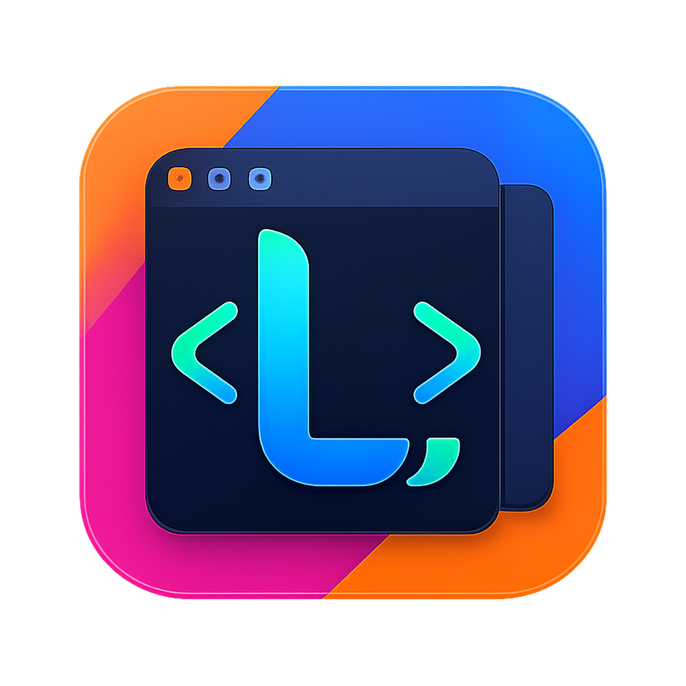
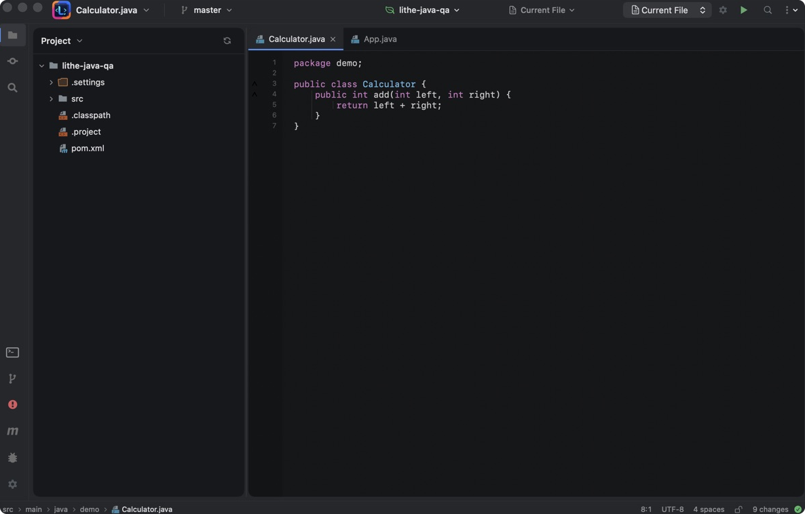
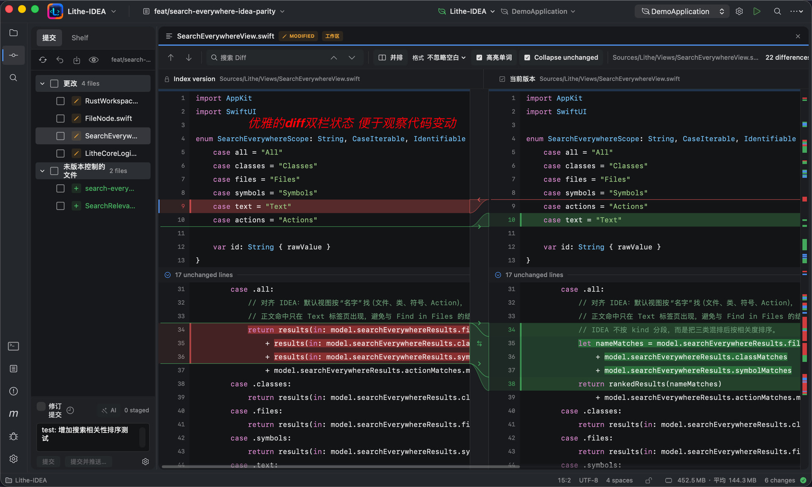
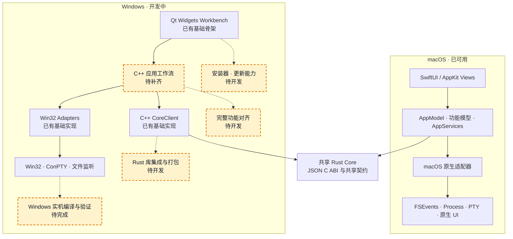
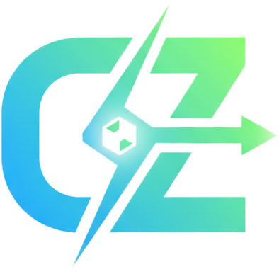

<div align="center">
  

  <h1>Lithe</h1>

  <p><strong>为 AI 辅助开发保留 IDEA 核心习惯</strong></p>
  <p>原生 macOS IDE · 熟悉的操作路径 · 更轻的内存占用</p>
  <p><em>AI 负责大量编写，Lithe 负责让你看得清、跑得通、审得明白。</em></p>

  <p>
    <a href="./README.md"><strong>English</strong></a> ·
    <a href="#核心功能">核心功能</a> ·
    <a href="#产品截图">产品截图</a> ·
    <a href="#如何使用">如何使用</a> ·
    <a href="#架构图">架构图</a> ·
    <a href="#如何开发">如何开发</a> ·
    <a href="#联系我们">联系我们</a>
  </p>

  <p>
    <a href="https://github.com/1lck/Lithe-IDEA/releases/latest"></a>
    
    
  </p>
  <p>
    
    
    <a href="./LICENSE"></a>
  </p>

  <p>
    <a href="https://github.com/1lck/Lithe-IDEA/releases/latest"><strong>下载最新版本</strong></a> ·
    <a href="https://github.com/1lck/Lithe-IDEA">查看 GitHub 仓库</a>
  </p>
</div>

<table align="center">
  <tr>
    <td align="center">🧭<br><strong>熟悉的 IDE 核心</strong><br>Project · Editor · Search · Diff</td>
    <td align="center">⚡<br><strong>原生、按需启动</strong><br>SwiftUI/AppKit，重量级服务需要时才启动</td>
    <td align="center">🤖<br><strong>适配 AI 开发</strong><br>查看、运行、Diff、撤销和提交外部修改</td>
    <td align="center">🪶<br><strong>更轻的资源占用</strong><br>让常驻应用保持小而专注</td>
  </tr>
</table>

<p align="center">
  
</p>

## 项目简介

Lithe 是一款面向 AI 辅助开发的原生 macOS IDE。它保留 IntelliJ IDEA 用户熟悉的项目浏览、编辑、搜索、代码导航、Git、运行和调试工作流，同时让 Java 语言服务、终端、Maven 和调试进程只在需要时启动。

当外部 AI 工具修改项目后，你可以用 Lithe 定位受影响的代码、运行项目、审查 Diff，并决定暂存、撤销或提交哪些修改。

> **熟悉的 IDE 核心体验，更轻的资源占用。**

## 核心功能

1. 适配 Spring Boot 项目体系，适合 Java 开发。
2. 支持 Maven 管理、断点调试和自定义启动配置。
3. 支持 Git 管理和 Diff 审查。
4. 支持双击 Shift 搜索，以及 `Command + Shift + F` 全局搜索。
5. 支持代码跳转和代码引用查找。
6. 支持本地快照保存。
7. 支持在应用内打开多个项目。
8. 支持在同一窗口打开多个文件，各文件相互独立。
9. 支持使用 AI 自动生成 Commit Message，并可自定义格式。
10. 支持多种 Markdown 语法渲染，与语雀一致。
11. 支持查看应用的本地内存占用情况。
12. 支持通过 Homebrew 一键安装和更新。
13. 支持在应用内一键更新并安装。
14. 持续修复问题并优化用户体验。

## 产品截图

<p align="center">
  
  
</p>

<p align="center">
  
</p>

<p align="center">
  
  
</p>

<p align="center">
  
</p>

<p align="center">
  
  
</p>

<p align="center">
  
  
</p>

## 如何使用

Lithe 需要 macOS 13 或更高版本。Java 项目功能需要 JDK，推荐使用 JDK 17 或 JDK 21；语义导航需要 Eclipse JDT LS；Maven 项目需要项目自带 `mvnw` 或系统中可用的 Maven。

从 [GitHub Releases](https://github.com/1lck/Lithe-IDEA/releases/latest) 下载最新的 macOS `.dmg`。如果该版本提供独立架构安装包，M 系列芯片选择 `arm64`，Intel 芯片选择 `x86_64`。打开磁盘映像，将 `Lithe.app` 拖入 `/Applications` 后启动。

也可以使用项目自建的 Homebrew Tap 安装 Lithe。Tap 会校验 Release 的 SHA256，并在安装完成后清除应用的 macOS quarantine 标记：

```bash
brew tap 1lck/lithe https://github.com/1lck/Lithe-IDEA.git
brew install --cask 1lck/lithe/lithe
```

升级 Lithe：

```bash
brew update
brew upgrade --cask lithe
```

如果 macOS 阻止打开来自未识别开发者的 App，右键点击 App 并选择 **打开**，或前往 **系统设置 → 隐私与安全性 → 仍要打开**。仅在确认 App 来自 Lithe 官方 GitHub Release 时，也可以运行：

```bash
xattr -dr com.apple.quarantine "/Applications/Lithe.app"
open "/Applications/Lithe.app"
```

使用 Homebrew 安装 JDT LS：

```bash
brew install jdtls
```

打开项目后，在 **Settings → Project** 中配置 Project JDK、Maven 和 Maven 使用的 JDK。Lithe 也会从常见的系统位置自动探测 Java 与 Maven。

### 数据库工作台与外部 MCP

可选的 Database 工作台通过按需启动的 Rust helper 支持 MySQL、MariaDB、
PostgreSQL、SQLite、Microsoft SQL Server、MongoDB、Redis 和 Nacos；用户没有
使用数据库功能时不会启动数据库进程。SQL 连接
提供表格增删改、TSV 批量粘贴、当前分页查找替换，以及 CSV、JSON、SQL 导入导出。
MariaDB 复用 MySQL 兼容引擎；SQL Server 使用原生 TDS 数据表格适配器。MongoDB
集合支持文档表格、分页、筛选、索引查看，以及受安全规则保护的新增、修改和删除。
Redis 使用增量 `SCAN` 分页，不会默认全量加载键空间；第一版支持 String 和 Hash
编辑、TTL 修改、键重命名和删除。Nacos 支持配置搜索与发布，以及服务和实例健康
状态查看。Redis 和 Nacos 写入同样遵守只读与生产环境保护规则。SQL 备份默认完整
导出，不会按每张表截断行数；恢复 SQL 备份始终需要确认，会先验证备份内容，再将
当前数据库对象和数据恢复为备份状态。发布包同时包含
`Contents/Helpers/lithe-db-mcp`，这是供外部自动化工具调用的独立 MCP stdio
适配器，只提供数据库工具，不包含产品内 Agent 自然语言对话功能。

为便于审计，`third_party/dbx` 保存了
[t8y2/dbx](https://github.com/t8y2/dbx) 在提交
[`996ce42e80387bba4b33a2bf1713f590ef79d476`](https://github.com/t8y2/dbx/commit/996ce42e80387bba4b33a2bf1713f590ef79d476)
的仅源码快照。它不是 Git 子模块，也不是运行时依赖，不会被打入 Lithe 发布包；
数据库 helper 由本项目独立实现和构建。
当前工作台使用的八个数据库品牌标识已独立复制到 `Resources/DatabaseIcons`。
素材目录内保留了 DBX 来源、Apache-2.0 许可证及商标用途说明；应用打包和运行时
不会从 `third_party` 目录读取这些素材。

## 架构图



## 如何开发

开发环境需要 Swift 6.2 或更高版本。运行完整测试需要 Xcode；基础 SwiftPM 构建只需要 Command Line Tools。

在项目根目录运行开发版本：

```bash
./scripts/preview.sh
```

该脚本会构建并链接 Rust Core，然后启动 macOS 应用。只验证 Swift 源码时可以运行：

```bash
swift run --disable-sandbox Lithe
```

构建 App Bundle：

```bash
./scripts/package-app.sh
open dist/Lithe.app
```

提交改动前运行：

```bash
./scripts/test-macos.sh
./scripts/verify-core.sh
./scripts/verify-git-graph.sh
./scripts/verify-service-boundaries.sh
./scripts/verify-shared-contracts.sh
./scripts/verify-windows-boundaries.sh
./scripts/verify-rust-core.sh
```

目录归属、跨平台边界和共享规则见[仓库目录与共享边界](./docs/architecture/repository-layout.md)。提交功能改动时，请说明验证方式和已知限制。

## 项目支持

### ❤️ 赞助商

<table>
  <tr>
    <td width="112" align="center">
      <a href="https://shu26.cfd/">
        
      </a>
    </td>
    <td>
      <a href="https://shu26.cfd/"><strong>Code GO</strong></a> 提供 Claude 系列模型的中转支持，并支持 Lithe 的开发。感谢 Code GO 对本项目的支持！
    </td>
  </tr>
  <tr>
    <td width="112" align="center">
      <a href="https://codezsy.com">
        
      </a>
    </td>
    <td>
      <a href="https://codezsy.com"><strong>CodeZ</strong></a> 提供 GPT 系列模型的中转支持，并支持 Lithe 的开发。感谢 CodeZ 对本项目的支持！
    </td>
  </tr>
  <tr>
    <td width="112" align="center">
      <a href="https://www.fastaitoken.com/">
        
      </a>
    </td>
    <td>
      <a href="https://www.fastaitoken.com/"><strong>FastAI</strong></a> 提供大模型服务支持，并助力 Lithe 的开发。感谢 FastAI 对本项目的支持！
    </td>
  </tr>
</table>

### ⭐ 特别鸣谢

<p align="center">
  <a href="https://linux.do/">
    
  </a>
</p>

<p align="center">
  <strong>关于 AI 的一切，欢迎前往 LINUX DO！祝社区越来越好～</strong>
</p>

### 贡献者

感谢所有参与 Lithe 开发和改进的贡献者。

<a href="https://github.com/1lck/Lithe-IDEA/graphs/contributors">
  
</a>

### License

Lithe 采用 [Apache License 2.0](./LICENSE) 授权。

## Star History

每个日期点表示北京时间当天 `00:00` 时仓库的累计 Star 数。图表从 2026 年 8 月 2 日的 0 开始。

<a href="https://www.star-history.com/#1lck/Lithe-IDEA&Date">
  
</a>

## 联系我们

欢迎加入 Lithe-IDEA 交流群讨论使用体验、反馈问题，也可以直接联系作者。

<table align="center">
  <tr>
    <td align="center"><strong>加入交流群</strong></td>
    <td align="center"><strong>联系作者</strong></td>
  </tr>
  <tr>
    <td align="center"></td>
    <td align="center"></td>
  </tr>
</table>
