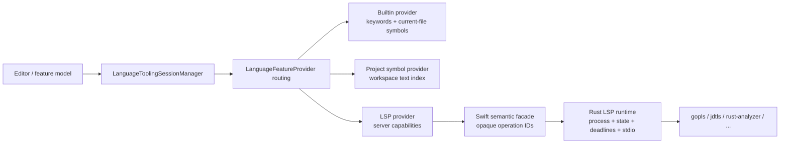

# 语言工具与 LSP 架构

本文说明 Lithe 当前的语言能力分层、LSP 兼容边界，以及接入新语言服务器时必须遵守的约束。公开的 Rust JSON 命令仍以
[`rust-core-api.md`](../../shared/contracts/rust-core-api.md) 为准。

## 设计目标

语言能力不应等同于“已经启动一个 LSP 进程”。当前实现遵循以下规则：

1. 编辑器只依赖统一的 `LanguageFeatureProvider`，不直接依赖具体语言服务器。
2. 轻量本地能力无需外部进程；LSP 默认关闭，只有用户在当前工作区显式启用后才按需启动。
3. 可调用的 LSP 功能以服务器 `initialize` 响应和动态注册结果为准，不能根据语言名称硬编码。
4. LSP 进程、stdio、JSON-RPC 状态机、deadline 和结果归一化属于 Rust Core；平台 adapter 只负责可执行文件与运行环境发现。
5. 单个 provider 失败、缺失或返回空结果时，不应阻断仍可工作的本地能力。

## 组件边界



| 层 | 职责 | 不负责 |
| --- | --- | --- |
| `LanguageToolingSessionManager` | 文档同步、provider 选择、结果降级/合并、诊断和会话归属 | JSON-RPC 编解码、直接启动 `Process` |
| `LanguageFeatureProvider` | 声明单项能力、优先级和统一结果类型 | 维护 UI 状态 |
| `BuiltinLanguageFeatureProvider` | 当前文件标识符、轻量 hover/导航、语言关键字 | 类型推断、跨文件索引 |
| `ProjectSymbolFeatureProvider` | 用已预热的 workspace text index 生成跨文件、UTF-16 精确的词法导航候选 | 类型解析、替代 LSP 语义结果 |
| `LanguageServerFeatureProvider` | 将已协商的服务器能力适配到统一 provider 接口 | 猜测服务器能力 |
| `StdioLanguageServerSession` | 调用语义命令、投影 typed event，并以不透明 operation ID 交付 UI 回调 | LSP 请求 ID、frame、文档版本、协议超时或子进程 |
| Rust Core | LSP 子进程与 stdio、session/document state、请求 ID、deadline、frame、UTF-16 位置、结果归一化、动态能力 | 可执行文件发现、UI provider 路由 |
| macOS adapter | 工具发现、环境变量和用户可执行文件覆盖 | LSP 子进程、语言功能路由和协议语义 |

Rust Core 的 LSP 实现统一收在 `rust/lithe-core/src/lsp/`，根模块只作为稳定 facade，command runtime 仍通过 `crate::lsp::*` 使用公开契约：

```text
lsp/
├── interface/           # 通用 LSP engine、协议 reducer、transport 与稳定 DTO
│   ├── types.rs
│   ├── client.rs
│   ├── transport.rs
│   ├── host.rs
│   └── engine.rs
├── lightweight/         # 不启动语言服务器的编辑、snippet 和当前文件符号能力
│   ├── edits.rs
│   ├── snippets.rs
│   └── symbols.rs
└── languages/           # provider catalog 与语言/宿主模型 adapter
    ├── catalog.rs
    ├── jdt.rs
    └── swift.rs
```

共享的 LSP position/range 与协议 DTO 只能定义在 `interface/types.rs`；对应用公开的 runtime command/event DTO 位于 `interface/engine.rs`。`lightweight` 可以依赖这些协议 DTO，但 `interface` 不依赖轻量实现。`languages/jdt.rs` 封装 JDTLS 启动参数、配置与虚拟源码语义，generic engine 不按 Java 硬编码 capability。provider catalog 位于 `languages`，因为它描述可动态加载的语言/provider 元数据，而不是 client 状态机的一部分。

## Provider 路由

当前优先级由高到低为 `languageServer (200)`、`projectSymbols (100)`、`builtin (0)`。每次请求先按文件和功能过滤 provider，再按优先级路由：

- **Completion**：依次收集所有成功结果，保持高优先级顺序，并按 `label` 去重。因此 LSP 可提供精确候选，本地关键字和当前文件符号仍能补足结果。
- **Hover**：返回第一个非空结果；LSP 无结果或失败时继续询问本地 provider。
- **Definition/References/Implementation**：LSP 与 project-symbol provider 并发请求。项目索引候选先返回时只作为 provisional result 展示；LSP 在 750ms 交互时限内返回非空结果时仍以语义结果为准。服务器冷启动、索引繁忙或无响应而超过交互时限时，立即使用非空的项目候选，再降级到当前文件文本级导航。若两层本地回退都没有候选，则保持原 LSP 请求存活并向界面发布“预热/索引中”状态，避免把跨文件、依赖库或宏生成符号错误地提前结束为空结果。迟到的服务器结果不会覆盖已经呈现的非空导航事务。
- **Rename/Formatting/Code Action/Resolve/Execute Command**：目前仍是 LSP-only；未运行或未声明相应能力时应返回明确的 capability 错误。

provider 抛错不会让路由提前结束。这个策略用于隔离第三方语言服务器故障，但也意味着新增 provider 时必须给出稳定优先级，并避免返回伪造的“成功但无意义”结果。

project-symbol provider 不按扩展名或 provider ID 分支。它从光标提取通用标识符，使用 workspace search index 的 whole-word/case-sensitive 查询缩小候选文件，再在后台读取命中行并计算精确 UTF-16 范围。打开且未保存的当前文档直接扫描 editor buffer，避免磁盘索引覆盖用户的新输入。Definition/Implementation 只用语言无关的结构词提高候选排序；最终语义仍以 LSP 为准。

成功的导航结果按 method、workspace、文件、位置和文本指纹保存 8 秒进程内缓存；相同的并发请求也只发送一次，再把结果扇出给所有调用方。任一文档同步、关闭、外部文件变更、catalog/root/session 变化都会使缓存失效，避免跨版本复用位置。每次 provisional/final/cache/interactive-deadline 命中都会把 `source`、`elapsedMs` 和结果数写入 LSP 控制中心的“运行日志”，便于区分索引耗时、服务器耗时和交互超时降级。

编辑器的 `⌘B` 是 declaration-or-usages 命令，而不是 references 的别名：先请求 definition；引用位置得到单个目标时直接跳转，已经位于声明 token 上时再请求 references 并打开轻量选择器。完整 Find Usages 使用相同的文件、行号和代码预览行，但保留在底部工具窗口中。导航前后位置由 `EditorNavigationFeatureModel` 维护，可以用 `⌘[`/`⌘]` 返回和前进。

## 无进程能力

Rust Core 的 `lsp.builtinCompletions`、`lsp.builtinHover` 和
`lsp.builtinNavigation` 只读取当前文件文本。Swift 层另外为 Go、Swift、Rust、Python、JavaScript 和 TypeScript 提供关键字候选；即使 Rust Core 未链接，关键字补全仍可使用。
内置标识符扫描在一次遍历中同时维护 byte offset、line 和 UTF-16 column；禁止为每个 token 从文件开头重复换算位置，否则大文件导航会退化为 O(n²) 并阻塞 UI 回退路径。

这些结果是可用性降级，不是类型系统：

- 不解析依赖，不启动构建工具，不访问网络；
- 不保证跨文件定义、重载解析或类型正确性；
- 位置统一使用零基行号和 UTF-16 列，确保可与 AppKit 和 LSP 结果合并。

## Catalog 与工具发现

内置 provider catalog 位于
[`rust/lithe-core/resources/lsp/language-providers.json`](../../rust/lithe-core/resources/lsp/language-providers.json)。项目可以通过 `.lithe/lsp/language-providers.json` 按 `id` 覆盖内置字段、添加 provider，或使用 `disabled: true` 禁用 provider。配置格式由 [`docs/reference/language-providers.schema.json`](../reference/language-providers.schema.json) 定义：

```json
{
  "$schema": "../../docs/reference/language-providers.schema.json",
  "version": 2,
  "providers": [
    {
      "id": "go",
      "languageServerLaunch": {
        "executableNames": ["gopls-custom", "gopls"],
        "arguments": [],
        "environment": {
          "GOTOOLCHAIN": "auto"
        },
        "initializationOptions": {}
      },
      "languageServerInstallation": {
        "homebrewFormula": "gopls",
        "officialDownloadURL": "https://go.dev/gopls/"
      }
    },
    {
      "id": "templ",
      "displayName": "Templ",
      "fileExtensions": ["templ"],
      "capabilities": ["languageServer", "formatting"],
      "activationPolicy": "onDemand",
      "languageId": "templ",
      "languageServerLaunch": {
        "executableNames": ["templ"],
        "arguments": ["lsp"]
      }
    }
  ]
}
```

`executableNames` 按顺序尝试，`environment` 覆盖 Lithe 进程环境中的同名键，`initializationOptions` 原样进入 LSP `initialize` 参数。可选的 `validationArguments` 会在候选进入 session 解析前直接执行，例如 Rust provider 使用 `["--version"]` 排除存在于 `PATH` 但缺少组件的 rustup proxy。探测结果按路径和参数缓存 30 秒，退出码非零或超时的候选不会被视为可用。catalog 更新后，session manager 会丢弃 descriptor 已变化的旧会话和 runtime，并由 runtime factory 根据新 descriptor 延迟创建 runtime；因此项目新增 provider 或覆盖启动命令不再受应用启动时的内置 runtime 列表限制。

macOS discovery 的查找顺序包括项目 `.lithe` 工具目录、`LITHE_<TOOL>_PATH`/`LITHE_TOOL_<TOOL>_PATH`、`PATH` 和常见系统目录；`gopls` 等 Go 工具还会检查 `GOBIN`、`GOPATH/bin`、`~/go/bin` 和 `~/.go/bin`。discovery 只查找，不自动安装软件。

打开工作区或切换项目时，所有 LSP provider 均从关闭状态开始。用户必须在 LSP 控制中心逐个启用；只修改可执行文件、Homebrew 安装结果或 Java LSP 运行 JDK，不会隐式启用或启动服务器。Java 的 JDTLS 工具路径与 LSP 运行 JDK 配置在关闭状态下仍可编辑和持久化。

LSP 控制中心标题栏的工具设置会在用户偏好中保存每个 provider 的可执行文件覆盖路径。session 创建时先验证并使用该路径，路径失效时继续使用 catalog 候选进行自动探测。Homebrew formula 和官方兜底地址都来自 `languageServerInstallation`，Swift 不维护 provider ID 映射。安装仍由平台层以参数数组直接执行 `brew install`，不经过 shell；没有 Homebrew/formula 时只打开对应项目的 HTTPS 官方发布或安装页面，避免用一套不安全的通用解压逻辑处理不同项目的签名和包结构。

项目配置是可执行工具配置，只有打开受信任项目时才应启用。JSON 可以声明 executable name 和参数，但不能声明 shell、任意安装命令或关闭路径/URL 校验；进程创建、超时、可执行文件验证、Homebrew 调用方式和 HTTPS 限制仍属于平台安全边界。

## LSP 会话与兼容性

当前 transport 是 LSP 标准的 stdio `Content-Length` framing。一个 provider 在一个 workspace root 下复用一个 session；同一 provider 切换到另一个 root 时，manager 会停止旧 session 并创建新 session。

生产路径由 Rust engine 持有长生命周期 `sessionID -> RuntimeSession` registry。每个 runtime 同时拥有子进程、stdio、frame buffer、文档版本、pending request/deadline、capability 和 diagnostics；Swift 只保存不透明 `sessionID` 与 application-level `operationID`。`syncDocument` 由 Rust 决定发送 version 1 的 `didOpen` 或递增版本的 `didChange`，`pollEvents` 只返回 typed state/feature/diagnostic/result/error 事件。协议 reducer/host 只作为 engine 内部实现与纯函数测试 seam，不属于应用公开命令面。

启动顺序：

1. Swift 完成可执行文件和环境发现，向 Rust 提交 typed `startServer`；
2. Rust engine 创建 session、启动进程并安装 stdout/stderr reader，再发送 `initialize`；
3. 收到响应后，Rust 保存服务器 capability，发送 `initialized` 和 provider adapter 通知；
4. manager 发布实际 capability，随后通过 `didOpen`/全量 `didChange` 同步文档；连续编辑在应用层以 120ms 窗口合并，语义导航发起前强制刷新最新 buffer；相同文本指纹不会重复发送；
5. Rust 以 LSP request ID 关联 deadline，并用不透明 operation ID 把 terminal result 投影给 Swift。

服务端 capability 可以来自 initialize 响应，也可以通过 `client/registerCapability` 和
`client/unregisterCapability` 动态变化。客户端处理有文档/version 归属的 diagnostics、workspace configuration/folders、work-done progress 和 apply-edit 协议；未知的服务端 request 返回 JSON-RPC `Method not found`，未知 notification 作为 typed log/event 保留。

关闭文档时发送 `textDocument/didClose` 并清除该文档诊断。停止 session 时先请求 `shutdown`，收到响应后发送 `exit`；若服务器无响应，则由超时路径强制停止进程。不要直接以 `terminate()` 代替正常 LSP 关闭流程。

### 当前限制

- 只支持 stdio transport，尚无 socket/TCP 或服务器自定义握手 adapter。
- session 当前以 provider ID 和单个 workspace root 为单位，尚无 multi-root session。
- `workspace/applyEdit` 只提供协议确认和 normalized edit 数据，实际应用仍必须经过编辑器工作区安全校验。
- initialize 可协商 snippet、resolve、inlay hint、folding range、code lens 和 workspace symbol；UI 只启用已完整投影且服务器实际声明的能力。
- 文档同步当前仍发送全量文本，没有按服务器类型实现增量 diff；应用层只负责短窗口合并和相同文本去重。
- workspace text index 当前是进程内预热和文件监听增量更新，不跨应用启动持久化；它提供快速词法候选，不是类型图或调用图。
- catalog 描述的是“可尝试启动的工具”；最终功能必须以运行时服务器 capability 为准。
- project config 是受信任的项目配置，只接受 schema 中的 typed 字段，不执行 shell 命令。

## 接入新 LSP 的检查清单

1. 在 catalog 中定义稳定 `id`、文件匹配规则、`languageId`、候选 executable 和参数；存在 shim/proxy 的工具应声明无副作用的 `validationArguments`。
2. 需要安装入口时定义 `languageServerInstallation`；不要在 Swift UI 中增加 provider ID 分支。
3. 确认服务器支持 stdio 和标准 `Content-Length` framing。
4. 不在 UI 或 manager 中按语言写分支；服务器差异应进入 descriptor 或独立 adapter。
5. 用 initialize 响应验证 capability，不把 catalog 的 `languageServer` 标记当成 feature 支持证明。
6. 至少测试 initialize timeout/error、didOpen/change/close、请求 timeout/late response、shutdown/exit、强制停止和异常退出。
7. 包含 malformed/partial/multiple frame、动态能力、stale diagnostics、UTF-16、带空格/非 ASCII 文件 URI，以及启动即输出的场景。

## 真实 gopls 验证

[`RealGoplsIntegrationTests.swift`](../../Tests/LitheTests/RealGoplsIntegrationTests.swift)
会穿过 manager、Swift semantic facade 和拥有进程的真实 Rust Core。测试默认不启动外部工具，需要显式开启：

```bash
scripts/build-rust-core.sh --debug --target aarch64-apple-darwin

LITHE_RUN_GOPLS_INTEGRATION=1 \
LITHE_GOPLS_PATH="$HOME/.go/bin/gopls" \
swift test --disable-sandbox --no-parallel \
  --triple arm64-apple-macosx \
  -Xswiftc -Xfrontend -Xswiftc -disable-round-trip-debug-types \
  -Xlinker -force_load \
  -Xlinker "$(pwd)/rust/target/macos/aarch64-apple-darwin/debug/liblithe_core.a" \
  --filter RealGoplsIntegrationTests
```

`-force_load` 是必要条件：测试包同时包含 C bridge 的 weak fallback；普通链接可能在没有加载 Rust archive 的情况下仍然成功。Intel macOS 需要把 target/triple 和库路径替换为对应的 `x86_64` 产物。
