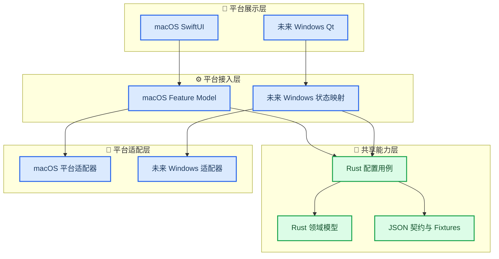
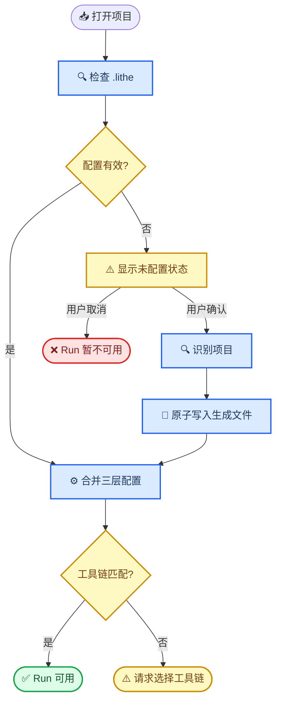
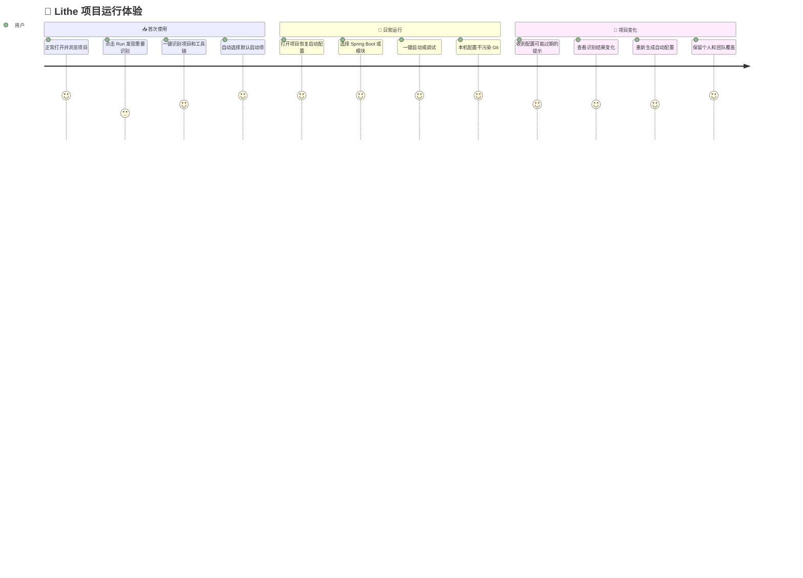

# Lithe 项目运行配置开发计划

_共享 Run Configuration 模块与 macOS 首次接入方案，2026-08-07_

---

## 📋 决策与范围

本计划把项目运行配置建设为一项共享能力，macOS 是第一个接入和交付的平台。它不是一套 macOS 专属实现，也不要求 Windows 在本轮同步开发。

核心决策如下：

- 使用 `.lithe/` 作为项目级配置容器，运行配置位于 `.lithe/run/`，工具链配置位于 `.lithe/toolchains/`
- Rust Core 负责配置模型、识别、合并、校验、工具链匹配、状态诊断和启动计划生成
- `shared/contracts/` 和 `shared/fixtures/` 固化跨平台协议与行为样例
- macOS 只实现文件、运行时和进程适配，以及 SwiftUI 展示
- Windows 不进入本轮排期；未来直接复用共享能力，只补 Win32 适配、Qt UI 和 Composition Root 接线
- 首版只支持类型化的 Java/Maven 配置，不开放任意 `executable + arguments` 通用进程配置
- `.lithe/run/generated.json` 是一键 Run/Debug 的必要配置来源；文件缺失时提示重新识别，不静默回退旧扫描逻辑
- 不在打开项目时自动修改仓库；用户点击 Run 或主动选择识别后，才生成 `.lithe` 文件
- 自动识别只覆盖生成文件，不覆盖团队配置和本机配置

这项工作的正确产品定义是：

> 开发一个共享的 Run Configuration 模块，macOS 作为第一个接入平台。

### 当前实现基础

现有代码已经提供以下基础能力：

- Rust Core 可以扫描 Java 主类、Spring Boot 入口和 Maven 模块，并生成稳定配置 ID
- macOS 已支持 Current File、Spring Boot 和 Maven Module 三类运行配置
- macOS 已支持项目 JDK、Maven、Maven JDK 和运行参数的本机持久化
- macOS 的 Run、Debug、Maven 和 JDT LS 已经通过项目运行时服务解析 JDK/Maven
- Windows 已通过相同 Rust C ABI 消费共享命令，证明共享契约模式可行

本次改造重点是增加共享配置协议和协调层，并逐步把现有 Swift 中可跨平台复用的运行规则下沉到 Rust，而不是从零重写进程执行系统。

## 🎯 目标与非目标

### 产品目标

- 老项目完成一次识别后即可稳定一键运行
- 团队可以提交运行配置和工具链要求，新成员克隆项目后直接使用
- JDK、Maven 等本机绝对路径不会污染团队配置
- 重新识别不会覆盖团队配置和个人配置
- Run、Debug、Maven 和 JDT LS 消费同一套有效工具链解析结果
- 缺失、损坏、版本不兼容和工具链不匹配都有明确的 UI 状态与修复入口
- 项目打开、编辑、Git、搜索和终端不因缺少运行配置而被阻塞

### 架构目标

- 相同输入在 macOS 和未来 Windows 上得到相同的有效配置和启动计划
- Swift 和 C++ 不重复实现 JSON 合并、Maven 参数构造或工具链匹配规则
- 共享模型不包含 AppKit、SwiftUI、Win32、Qt、原生进程句柄或平台绝对路径
- 平台能力通过端口注入，可使用 mock 进行自动化测试
- 所有共享行为先有契约或 fixture，再接平台 UI

### 首版非目标

- 不开发 Windows 端功能
- 不支持 Node、Python、Docker、Tasks、Extensions 等其他运行类型
- 不支持任意 Shell 命令或通用 `process` 配置
- 不在首版建设完整的项目可信任机制
- 不实现自动安装 JDK 或 Maven
- 不要求用户手写 JSON 才能完成正常运行流程
- 不创建尚未使用的 `.lithe/tasks/`、`.lithe/debug/`、`.lithe/languages/` 等空目录

未来扩展新运行类型时，应增加有明确语义的配置类型，例如 `node.package-script`、`python.module` 或 `docker.compose-service`。通用进程类型需要在项目信任和命令安全边界确定后再引入。

## ⚙️ 共享能力先于平台接入

### 分层结构



### Rust Core 负责共享业务

Rust Core 应拥有以下领域模型：

- `ProjectManifest`
- `RunConfigurationDocument`
- `RunConfiguration`
- `ToolchainRequirementsDocument`
- `ToolchainCandidate`
- `ToolchainResolution`
- `EffectiveRunConfiguration`
- `LaunchPlan`
- `RunConfigurationDiagnostic`
- `ProjectRunConfigurationState`

Rust Core 应提供以下业务用例：

| 用例                                      | 作用                       |
| ----------------------------------------- | -------------------------- |
| `runConfig.inspect`                       | 检查配置存在性、版本和结构 |
| `runConfig.generate`                      | 根据项目扫描结果生成配置   |
| `runConfig.resolve`                       | 合并配置并匹配工具链       |
| `runConfig.updateOptions`                 | 生成运行参数覆盖文档       |
| `runConfig.createUserConfiguration`       | 校验并生成用户配置文档     |
| `runConfig.createLaunchPlan`              | 生成平台无关的启动计划     |

这些用例的输入输出通过 Rust JSON 协议暴露。更新用例只返回待原子写入的文档，不直接操作平台文件系统。平台接入层可以控制调用顺序，但不能自行复制解析、合并、稳定 ID、参数解析或启动参数构造规则。

### 启动计划保持平台无关

共享核心不返回 Shell 字符串，也不返回平台绝对可执行文件路径。它返回参数数组、相对工作目录和工具链引用：

```json
{
  "executable": {
    "toolchain": "project-maven"
  },
  "arguments": ["-B", "-ntp", "-pl", "backend", "-P", "dev", "spring-boot:run"],
  "workingDirectory": "backend",
  "environment": {
    "JAVA_HOME": {
      "toolchain": "project-jdk",
      "property": "home"
    }
  }
}
```

Rust 负责：

- Current File、Spring Boot 和 Maven Module 参数构造
- `-pl`、Profiles、main class、JVM 参数和程序参数组合
- 参数稳定排序
- 工作目录和配置引用校验
- Run/Debug 对同一配置的投影

平台适配器负责：

- 将 `project-jdk` 和 `project-maven` 解析成本机绝对路径
- 判断文件是否存在且可执行
- 注入最终环境变量
- 启动、停止和监听原生进程

### macOS 只保留平台职责

macOS 侧需要以下端口或等价能力：

| 端口            | macOS 职责                        |
| --------------- | --------------------------------- |
| 配置文件存储    | 读取、建目录、原子写入、权限错误  |
| Runtime Locator | 探测和校验本机 JDK、Maven、JDT LS |
| Process Adapter | 启动进程、输出、停止、生命周期    |
| UI Adapter      | 弹窗、通知、设置入口和配置编辑器  |

macOS Feature Model 只执行以下协调：读取配置、调用共享用例、转发共享状态、请求用户确认、应用文件写入计划，以及把 `LaunchPlan` 交给进程适配器。

未来 Windows 只需要提供对应的 Win32 文件存储、Runtime Locator、Process Adapter、Qt 状态映射和 Composition Root。配置协议、识别、合并、校验、工具链匹配和启动计划不应在 C++ 中重写。

## 💾 使用命名空间组织 `.lithe`

### 首版目录

```text
.lithe/
├── .gitignore
├── project.json
├── run/
│   ├── generated.json
│   ├── configurations.json
│   └── local.json
└── toolchains/
    ├── requirements.json
    └── local.json
```

`.lithe` 根目录只保存顶层清单和模块目录，不直接平铺运行配置。未来可以自然扩展：

```text
.lithe/tasks/
.lithe/debug/
.lithe/languages/
.lithe/extensions/
.lithe/format/
.lithe/ai/
```

这些未来目录不在首版创建，也不进入本轮开发范围。

### 文件所有权

| 文件                           | 内容                 | Git  | 生成器覆盖 |
| ------------------------------ | -------------------- | ---- | ---------- |
| `project.json`                 | 协议版本、团队默认项 | 提交 | 否         |
| `run/generated.json`           | 自动识别启动项       | 提交 | 是         |
| `run/configurations.json`      | 团队新增和覆盖       | 提交 | 否         |
| `run/local.json`               | 本机运行覆盖         | 忽略 | 否         |
| `toolchains/requirements.json` | 项目工具链要求       | 提交 | 是         |
| `toolchains/local.json`        | 本机工具链路径       | 忽略 | 可重新匹配 |
| `.gitignore`                   | 忽略本机文件         | 提交 | 初始化创建 |

建议使用 `.lithe/.gitignore`，不要自动修改项目根目录的 `.gitignore`：

```gitignore
run/local.json
toolchains/local.json
**/*.tmp
```

共享文件必须满足：

- 路径相对项目根目录
- 路径分隔符统一使用 `/`
- 不包含本机绝对路径
- 不包含生成时间戳
- 数组和对象使用稳定排序
- 相同输入产生相同 JSON

### 顶层清单

```json
{
  "version": 1,
  "defaultRunConfiguration": "spring:com.example.DemoApplication"
}
```

`defaultRunConfiguration` 是团队默认项。用户最近一次选择继续保存在本机工作区会话中；只有本机没有历史选择时，才使用团队默认项。

### 自动生成运行配置

```json
{
  "version": 1,
  "generator": {
    "fingerprint": "sha256:project-inputs"
  },
  "configurations": [
    {
      "id": "spring:com.example.DemoApplication",
      "name": "DemoApplication",
      "type": "spring-boot.maven",
      "module": ".",
      "mainClass": "com.example.DemoApplication",
      "toolchains": {
        "java": "project-jdk",
        "maven": "project-maven"
      },
      "workingDirectory": ".",
      "jvmArguments": [],
      "programArguments": [],
      "mavenProfiles": []
    }
  ]
}
```

首版稳定 ID 继续使用：

- `current-file`
- `spring:<主类全名>`
- `module:<模块相对路径>`
- `user:<自定义名称>`

自动配置在 UI 中只读。用户编辑自动配置时，实际创建团队覆盖或本机覆盖，不直接改写 `generated.json`。

### 工具链要求与本机路径分离

共享要求示例：

```json
{
  "version": 1,
  "toolchains": {
    "project-jdk": {
      "type": "java",
      "minimumVersion": "21",
      "preferredVendor": "temurin"
    },
    "project-maven": {
      "type": "maven",
      "wrapper": "./mvnw",
      "version": "3.9",
      "java": "project-jdk"
    }
  }
}
```

本机解析示例：

```json
{
  "version": 1,
  "toolchains": {
    "project-jdk": {
      "home": "/Library/Java/JavaVirtualMachines/temurin-21.jdk/Contents/Home"
    },
    "project-maven": {
      "executable": "./mvnw"
    }
  }
}
```

识别工具链要求时必须区分：

- `maven.compiler.release` 更接近最低编译能力要求
- `.java-version`、`.sdkmanrc`、`mise.toml` 更接近明确项目版本
- Maven Wrapper URL 可以提供 Maven 版本
- 当前机器正在使用的 JDK 不能反向成为团队要求

## 🔄 配置生命周期保持可预测

### 打开、生成和运行



打开项目时只检查配置，不自动写入仓库。配置缺失时可以显示一次非阻塞提示；用户点击 Run 时再显示正式的“重新识别并生成”对话框。

### 三层配置按 ID 合并

合并优先级固定为：

```text
run/local.json > run/configurations.json > run/generated.json
```

合并规则固定为：

- 配置对象按稳定 `id` 合并
- 标量字段由高优先级来源覆盖
- Map 按键合并
- 参数和 Profiles 等数组整体替换
- `disabled: true` 隐藏自动配置
- `null` 不同时承担继承和删除两种含义
- 自动项消失后，相关覆盖进入 `orphaned` 状态，不静默丢弃
- 不使用没有字段规则的通用 JSON 深度合并

### 重新识别只更新生成内容

重新识别时：

- 只覆盖 `run/generated.json` 和 `toolchains/requirements.json`
- 不覆盖 `run/configurations.json`
- 不覆盖 `run/local.json`
- 不覆盖 `toolchains/local.json`
- 内容无变化时不写文件
- 先写工具链要求，最后写 `generated.json` 作为本次生成成功标志
- 生成失败时保留旧文件
- 使用稳定 ID 继续关联用户覆盖

后台可以使用 fingerprint 判断项目结构是否变化。现有配置仍有效时，只显示黄色“可能过期”提示，不自动生成 Git Diff。引用的模块或主类已经不存在时，只禁用受影响的配置并提供修复入口。

### 无入口也是有效结果

没有识别到运行入口时，仍写入一个合法但 `configurations` 为空的 `generated.json`，并提示用户手动创建配置。这可以区分“识别成功但没有入口”和“配置文件缺失”，避免重复弹出相同提示。

## 👤 用户只在必要时感知 `.lithe`

### 目标体验



### 老项目第一次使用

打开项目时不弹阻塞式窗口。编辑、浏览、Git、搜索、终端和基础 Java 分析正常工作，运行配置区域显示“未配置运行项”。

用户点击 Run 后显示：

```text
未找到项目启动配置

项目还没有 .lithe/run/generated.json。
需要识别项目后才能使用一键启动和调试。

重新识别不会覆盖你的自定义配置。

[取消] [重新识别并生成]
```

用户取消后只禁用 Run/Debug，不影响其他项目能力。确认后显示项目扫描和工具链匹配进度。生成成功时自动选中 Spring Boot 配置等更有用的默认项，并提供“完成并运行”。

### 已提交 `.lithe` 的团队项目

新成员克隆项目后，Lithe 立即读取团队配置。如果本机已经有符合要求的工具链，用户可以直接 Run。如果缺少匹配，只需完成一次本机 JDK/Maven 选择。

本机选择界面明确显示：

```text
此选择只保存在本机，不会提交到 Git。
```

完成匹配后不再重复提示，除非路径失效或项目要求变化。

### 编辑配置默认保存到本机

用户从 UI 修改以下内容时，默认保存为本机覆盖：

- JVM 参数
- 程序参数
- 临时 Maven Profiles
- 临时工作目录
- 本机 JDK
- 本机 Maven

界面明确显示“保存范围：仅本机”。需要团队共享时，用户主动点击“保存为项目配置”，并确认写入 `run/configurations.json`。

### 异常状态给出具体修复入口

| 异常                  | UI 行为                      |
| --------------------- | ---------------------------- |
| `generated.json` 缺失 | 重新识别并生成               |
| JSON 损坏             | 查看错误、打开文件、重新生成 |
| 协议版本过新          | 提示升级 Lithe               |
| 项目目录只读          | 显示失败路径和原因           |
| 没有运行入口          | 手动创建配置                 |
| JDK/Maven 不匹配      | 选择或刷新工具链             |
| 自动配置可能过期      | 黄色提示并允许查看变化       |
| 本机路径失效          | 重新匹配本机工具链           |
| 配置引用已删除模块    | 标记失效并提供修复           |

普通用户只应在首次生成、主动共享配置、项目结构变化或异常修复时感知 `.lithe`。正常使用不要求手写 JSON 或理解三层合并。

## ✍️ 按共享能力到 macOS 接入推进

本轮只交付共享能力和 macOS 接入，不开发 Windows 功能。预计达到 macOS 可发布质量需要 18–24 个开发日。

| 阶段    | 内容                |   估算 |
| ------- | ------------------- | -----: |
| Phase 0 | 共享契约与 fixtures | 2–3 日 |
| Phase 1 | Rust 配置领域能力   | 4–5 日 |
| Phase 2 | 识别与启动计划      | 3–4 日 |
| Phase 3 | macOS 适配与迁移    | 4–5 日 |
| Phase 4 | macOS UI 接入       | 2–3 日 |
| Phase 5 | 回归与架构验收      | 3–4 日 |

### Phase 0：冻结协议

- [x] 确定 `.lithe` 目录和文件所有权
- [x] 确定 JSON Schema v1
- [x] 确定稳定 ID、合并、禁用和孤儿规则
- [x] 确定共享状态、错误码和 `LaunchPlan`
- [x] 增加 Java 单模块、多模块、无入口和工具链 fixtures
- [x] 通过共享 JSON fixture 固化平台无关的 DTO 形状

完成标准：团队评审通过协议；未知版本、绝对路径和路径穿越都有明确错误；后续阶段不再自行发明字段语义。

### Phase 1：建立 Rust 配置领域能力

- [x] 实现配置解析和版本校验
- [x] 实现三层 ID 合并
- [x] 实现确定性排序和序列化
- [x] 实现配置诊断和有效状态
- [x] 实现工具链要求模型和候选匹配
- [x] 实现配置版本升级边界

完成标准：共享 fixtures 完全覆盖合并与错误行为；Swift 不实现第二套合并器。

### Phase 2：增强识别并生成启动计划

- [x] 复用并增强 Java 主类和 Maven 模块识别
- [x] 识别 Maven Wrapper 版本
- [x] 识别 JDK release/source/target 和项目版本文件
- [x] 生成 Current File、Spring Boot 和 Maven Module 配置
- [x] 生成 Run/Debug 共用的 `LaunchPlan`
- [x] 为现有 macOS 进程请求建立 golden parity 测试

完成标准：同一项目输入始终生成相同配置；共享启动计划与现有可执行文件、参数、工作目录和环境行为一致。

### Phase 3：接入 macOS 适配并迁移旧设置

- [x] 增加 `.lithe` 配置文件存储适配
- [x] 接入 macOS Runtime Locator 候选结果
- [x] 将 `LaunchPlan` 解析为现有 `ProcessRequest`
- [x] 迁移项目 JDK、Maven、Maven JDK 和运行参数
- [x] 写入 migration marker
- [x] 抑制自身写入引发的 watcher 循环
- [x] 保证原子写入失败时保留旧配置

旧 Key-Value 数据至少保留一至两个版本，不立即删除。新协议启用后，旧数据只用于一次迁移，不作为运行时静默回退来源。

### Phase 4：完成 macOS 用户体验

- [x] 未配置状态和非阻塞提示
- [x] “重新识别并生成”对话框
- [x] 识别进度和结果摘要
- [x] 工具链缺失与选择界面
- [x] 自动、项目和本机配置来源展示
- [x] 默认本机保存和显式项目保存
- [x] 损坏、只读、版本不兼容和无入口修复入口
- [x] 项目变化摘要和确认重新生成

完成标准：老项目首次使用只有一次明确配置流程；已有团队配置的项目只需要本机工具链匹配；日常 Run 不增加额外步骤。

### Phase 5：回归并收紧边界

- [x] 覆盖缺失、损坏、空配置和版本不兼容
- [x] 覆盖原子写入中断和只读目录
- [x] 覆盖 watcher 循环和内容无变化不写入
- [x] 覆盖稳定 ID、配置保留和孤儿覆盖
- [x] 覆盖 JDK/Maven 路径包含空格
- [x] 覆盖项目切换时丢弃陈旧回调
- [x] 覆盖 Run、Debug、Maven 和 JDT LS 统一工具链
- [x] 运行共享契约、Rust、Swift 和边界检查

完成标准：Swift 中不存在共享合并和 Maven 参数构造副本；共享层不依赖平台 API；macOS 功能可以发布；Windows 不需要本轮提交。

### 推荐 PR 顺序

1. ADR、Schema 和 fixtures
2. Rust 解析、合并和诊断
3. Java/Maven 识别与 `LaunchPlan`
4. macOS 配置存储和旧数据迁移
5. macOS UI 和修复流程
6. 回归、文档和默认启用

每个 PR 都应保持可单独验证，不在同一个 PR 同时引入协议、迁移、UI 和默认切换。

## ⚠️ 风险需要在设计阶段消除

| 风险                      | 处理方式                  |
| ------------------------- | ------------------------- |
| 首次打开修改仓库          | 用户确认后才生成          |
| 每次打开产生 Git Diff     | 稳定输出且无变化不写      |
| 绝对路径进入团队配置      | 仅允许进入本机文件        |
| watcher 重复扫描          | 识别自身写入并比较指纹    |
| 生成器覆盖用户修改        | 只覆盖生成文件            |
| Run 与 Debug 漂移         | 共用有效配置和启动计划    |
| macOS 与 Windows 规则漂移 | 规则全部进入 Rust         |
| 通用命令执行风险          | 首版只支持类型化配置      |
| 本机秘密被提交            | 本机文件默认忽略          |
| 本机秘密进入历史或搜索    | 排除本机配置文件          |
| 无入口反复提示            | 写入合法空生成结果        |
| 新版本配置被旧版本破坏    | 未知版本只读并提示升级    |
| 迁移后无法回退            | 暂时保留旧 Key-Value 数据 |

运行参数和本机文件不应保存明文密钥。需要秘密时优先引用系统环境变量或安全存储。`.lithe/**/local.json` 应默认从 Git、项目搜索和 Local History 中排除。

`generated.json` 不包含时间戳。应用升级不会自动重写生成文件；只有用户确认重新识别且内容发生变化时才写入。

## ✅ 完成标准覆盖架构与体验

### 共享能力

- [x] 配置解析、合并、校验、识别和启动计划都由 Rust 提供
- [x] 所有共享模型使用 UTF-8 JSON 和项目相对 `/` 路径
- [x] 共享 fixtures 覆盖成功、失败和边界状态
- [x] 相同输入在多次运行中产生相同输出
- [x] Swift 和未来 C++ 不需要翻译同一业务判断

### macOS 适配

- [x] 文件写入使用原子替换
- [x] 本机工具链路径不会进入共享文件
- [x] `LaunchPlan` 可以复现现有 Java/Maven 运行行为
- [x] 工作区切换和停止操作不会接收陈旧回调
- [x] 配置写入不会触发无限 watcher 刷新

### 兼容与迁移

- [x] 保留 `current-file`、`spring:<主类>` 和 `module:<路径>` 稳定 ID
- [x] 迁移 JDK、Maven、工作目录、VM 参数、程序参数和 Profiles
- [x] 迁移前后进程参数和环境一致
- [x] 旧数据在回退窗口内仍可读取
- [x] 缺少新配置时给出提示，不混用新旧配置来源

### 用户体验

- [x] 打开项目不因缺少 `.lithe` 被阻塞
- [x] 点击 Run 时可以一键识别、生成并继续运行
- [x] 用户取消只影响 Run/Debug
- [x] 团队项目可以直接恢复共享运行项
- [x] 本机配置默认不进入 Git
- [x] 重新生成保留团队和本机覆盖
- [x] 每个异常都有明确原因和下一步操作

### 架构评审规则

评审时使用以下判断：

> 如果未来 Windows 为实现相同行为，需要把 Swift 中的判断逻辑翻译成 C++，说明抽象位置错误，应继续下沉到 Rust Core。

本轮结束时，macOS 交付完整功能；架构产物必须是跨平台的。Windows 后续接入时只实现平台能力和界面，不开发第二套 Run Configuration。

## 🔗 相关文档

- [Repository Layout and Sharing Rules](./repository-layout.md)
- [Application Boundary Contract](../../shared/contracts/application-boundary.md)
- [Rust Core API](../../shared/contracts/rust-core-api.md)
- [macOS Service Boundaries](./mac-service-boundaries.md)
- [产品需求开发书](../需求开发书.md)

---

_本计划是 Run Configuration 项目的架构、产品体验和开发交付基线。实现期间如需改变目录、协议、合并规则或平台边界，应先更新本文并完成评审。_
