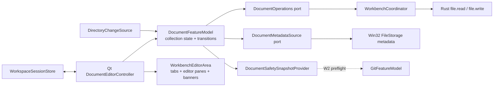

# Windows W1 document safety design

Status: draft for implementation on `feat/windows/document-safety`

Baseline: `integration/windows` at `cf8f429`

Issue: [#29](https://github.com/1lck/Lithe-IDEA/issues/29)

## Design read

This is a high-frequency IDE tool surface. Information density, predictable
keyboard behavior, data preservation, and explicit recovery actions take
priority over decorative motion. The design extends the existing Qt workbench
and Rust Core contracts; it does not introduce a second editor, file I/O, or
desktop architecture.

## Goals

- Keep independent text, disk baseline, dirty state, operations, and view state
  for every open workspace document.
- Never silently overwrite editor changes or a newer disk version.
- Protect tab close, project close, workspace switch, application exit, rename,
  delete, and future Git write preflight.
- Reject stale work after workspace switch, document close/reopen, or a newer
  operation for the same document.
- Deliver testable application state independently from Qt and Win32.

## Non-goals

- Project-wide replacement and complete Local History recovery.
- Autosave, crash recovery, or persistence of dirty text.
- Non-UTF-8 encodings.
- Java/Maven run and debug workflows.
- A global theme-settings redesign.

## W0 findings

- `DocumentFeatureModel` owns only one document and uses a global document
  generation in `WorkbenchCoordinator`.
- `WorkbenchEditorArea` already has a `QTabBar` and `QStackedWidget`, but all
  tabs share one `WorkbenchCodeEditor`.
- `WorkbenchWindow` directly owns open, switch, save, close, watcher, and error
  UI flows.
- `WorkspaceSessionStore` already persists open paths and the active path.
- Rust `file.read` returns only path/text and `file.write` overwrites directly.
- Workspace epoch invalidation and Win32 directory events already exist and
  should be retained.

## Architecture



The application model is authoritative for document content and safety state.
Qt owns only view objects and view-local history. Rust Core remains the only
workspace file read/write implementation. Win32 adapters provide watcher and
file metadata integration.

## Identity and path rules

```cpp
struct DocumentId {
    std::uint64_t workspaceEpoch;
    std::string normalizedPathKey;
    std::uint64_t openGeneration;
};
```

- Paths are workspace-relative, use `/`, reject absolute paths, drive letters,
  and `..`, and reuse `WorkspacePaths` validation.
- Identity comparison is case-insensitive on Windows; display spelling is kept
  separately.
- Closing and reopening the same path creates a new `openGeneration`.
- Read, save, metadata, and external-change operations also carry per-document
  generations.

`WorkbenchCoordinator` continues to reject results from an old workspace
epoch. Document operations must no longer use one global last-request-wins
generation: per-document ordering belongs to `DocumentFeatureModel`.

## Application state

```cpp
enum class DocumentLoadStatus { Loading, Ready, Failed };
enum class DocumentSaveStatus { Idle, Saving, Failed };
enum class ExternalStatus { InSync, Modified, Deleted };
enum class LineEnding { LF, CRLF };

struct DiskSnapshot {
    std::string version;
    std::string normalizedText;
    LineEnding lineEnding = LineEnding::LF;
    bool hasUtf8Bom = false;
};

struct DocumentState {
    DocumentId id;
    std::string displayPath;
    std::string currentText;
    DiskSnapshot saved;
    std::optional<DiskSnapshot> external;
    DocumentLoadStatus loadStatus = DocumentLoadStatus::Loading;
    DocumentSaveStatus saveStatus = DocumentSaveStatus::Idle;
    ExternalStatus externalStatus = ExternalStatus::InSync;
    std::optional<CoreError> error;
    bool readOnly = false;
    bool pendingSave = false;
};

struct DocumentWorkspaceState {
    std::uint64_t workspaceEpoch = 0;
    std::vector<DocumentId> order;
    std::optional<DocumentId> active;
    std::vector<DocumentState> documents;
};
```

`dirty` is derived from `currentText != saved.normalizedText`; returning to the
saved content clears dirty without requiring a save. A save result updates only
the baseline it actually wrote. If the user edits during a save, success does
not clear dirty for the newer content.

The model publishes immutable snapshots. It does not expose Qt types, Win32
handles, or mutable references to internal documents.

## File contract

### Read

`file.read` adds:

```json
{
  "path": "src/Main.java",
  "text": "normalized LF text",
  "version": "opaque raw-byte version",
  "lineEnding": "crlf",
  "hasUtf8Bom": false
}
```

- `version` is opaque outside Rust and covers raw bytes, including BOM and line
  endings.
- Rust validates UTF-8, removes BOM from returned text, and normalizes editor
  text to LF.
- Mixed line endings use a deterministic dominant-style rule and are saved
  using that style.

### Conditional atomic write

`file.write` adds `expectedVersion`, `lineEnding`, `hasUtf8Bom`, and a create
mode for externally deleted files. A successful response returns `newVersion`.

```json
{
  "path": "src/Main.java",
  "text": "normalized LF text",
  "expectedVersion": "opaque-version",
  "lineEnding": "crlf",
  "hasUtf8Bom": false,
  "createOnly": false
}
```

Rust must:

1. validate the workspace-relative path;
2. compare the current raw-byte version with `expectedVersion`;
3. return structured `external_conflict` without writing on mismatch;
4. encode BOM and line endings;
5. write and flush a same-directory temporary file;
6. perform a guarded atomic replacement;
7. preserve the original file on every pre-commit failure;
8. return the committed version and byte count.

`createOnly` recreates an externally deleted document only when the target is
still absent. If another process recreated it first, the operation returns an
external conflict.

The contract change requires Rust tests, C++ DTO/request tests, fixtures, and an
update to `shared/contracts/rust-core-api.md`.

## Model operations and transitions

### Open and activate

- `open(path)` reuses an existing document by normalized key or creates a new
  generation in `Loading`.
- Loading panes reject editing and show a bounded loading state.
- Success installs a new saved baseline and enters `Ready`.
- Failure keeps the tab open with Retry and Close actions.
- Activating another tab does not trigger a disk read when its buffer exists.

### Edit and save

- `setText(id, text)` changes only the target document.
- One write may be in flight per document.
- Save while saving sets `pendingSave`; repeated requests coalesce.
- A successful save updates the exact submitted baseline. If pending content is
  newer, one follow-up save starts with the latest text.
- A failed save stops the queue, preserves text/dirty, and exposes Retry.
- A version mismatch enters `ExternalStatus::Modified` and stores the observed
  external version without writing.

### External modification

- Watcher events are routed by normalized path to every open document, not just
  the active tab.
- Each document permits one external read at a time; later events coalesce into
  one follow-up read.
- Clean document: install the new disk snapshot, preserve cursor/selection and
  scroll as far as valid, and reset old Undo/Redo history.
- Dirty document: keep editor content and enter external conflict.
- Self-save events are ignored only when raw version, BOM, and line endings
  match the committed version. Timing windows are not correctness mechanisms.

### Resolve external conflict

- Keep Editor Version: retain text and dirty, acknowledge the observed disk
  version, and require a later explicit Save before writing.
- Load Disk Version: show a destructive confirmation with Cancel focused,
  reread the latest disk snapshot, then replace the buffer only after a
  successful read.
- A second external change before either action supersedes the stored external
  snapshot and keeps the conflict visible.

### External deletion

- Never close the tab automatically.
- Keep the in-memory text and show a deleted-on-disk state.
- Recreate uses `createOnly`; conflict or failure leaves the buffer intact.
- Close Document still uses dirty protection.

### Rename and delete initiated by Lithe

- Rename first updates the filesystem. Only success changes the document path
  and generation. Text, baseline, dirty, Undo/Redo, cursor, and scroll remain.
- Rename failure leaves every document field unchanged.
- Deleting a dirty document offers Cancel, Delete Disk and Keep Buffer, and
  Delete and Discard Changes. Cancel is default.
- Delete Disk and Keep Buffer enters the deleted-on-disk state.

### Close, workspace switch, and exit

`DocumentCloseCoordinator` creates a close plan for one tab or all dirty
documents. The UI offers Save All, Discard All, and Cancel, with Cancel as the
default.

- Save All attempts every independent document.
- Successful documents clear dirty; failures stay dirty with actionable errors.
- The original close/switch/exit continuation runs only when every requested
  save succeeds.
- Repeated window-close requests cannot bypass an active close plan.
- Model and UI lifetimes remain valid until close operations settle or are
  invalidated.

## Callback lifetime

- Workspace epoch rejects work from a prior workspace.
- Document open generation rejects work from a closed/reopened path.
- Per-operation generation rejects older reads, saves, metadata results, and
  watcher refreshes for the same document.
- Model callbacks use a shared lifetime gate; destruction invalidates the gate
  before member teardown.
- Qt queued callbacks use `QPointer` and re-check document identity before
  touching widgets.
- No callback captures a Qt widget as an unguarded long-lived raw pointer.

## W2 safety port

```cpp
struct DirtyDocumentInfo {
    std::string relativePath;
    bool saving;
    bool saveFailed;
    bool externalConflict;
};

struct DocumentSafetySnapshot {
    std::uint64_t workspaceEpoch;
    std::vector<DirtyDocumentInfo> dirtyDocuments;
};

class DocumentSafetySnapshotProvider {
public:
    virtual ~DocumentSafetySnapshotProvider() = default;
    virtual DocumentSafetySnapshot snapshot() const = 0;
};
```

W2 receives paths and safety state only. It cannot read document text or access
Qt controls through this port.

## Qt component design

### Components

- `DocumentEditorController`: binds immutable model snapshots to Qt, owns close
  and conflict UI flow, and forwards user intents to the model.
- `WorkbenchEditorArea`: manages tab order and a `QStackedWidget` of
  `DocumentEditorPane` objects.
- `DocumentEditorPane`: owns one `WorkbenchCodeEditor`, status banner, and
  view-local `QTextDocument`/Undo history.
- `DocumentStatusBanner`: persistent load/save/conflict/deletion/error surface
  with actionable buttons.
- `UnsavedDocumentsDialog`: lists affected documents and runs Save All,
  Discard All, or Cancel.

`WorkbenchWindow` keeps workspace-level orchestration and delegates document
details to the controller. New document behavior must not continue growing one
monolithic block in `workbench_window.cpp`.

### Tab state

- Reserve a fixed 14x14 status icon slot for every tab, including normal tabs.
- Keep filename text stable; do not append changing words or `*`.
- Priority: external conflict, save failure, saving, dirty, read-only, normal.
- Tooltip and accessible description list all simultaneous states even when
  only the highest-priority icon is visible.
- Tab reorder updates model order and persisted session order.

### Editor states

| State | Surface | Primary action | Secondary action |
|---|---|---|---|
| No documents | Existing editor empty state | Open from workspace tree | None |
| Loading | Disabled pane and bounded progress | None | Close tab |
| Load failed | Persistent error banner | Retry | Close tab |
| Save failed | Persistent error banner | Retry | Show details |
| External modified | Persistent warning banner | Keep Editor Version | Load Disk Version |
| External deleted | Persistent warning banner | Recreate File | Close Document |
| Read-only | Stable tab icon and pane notice | None | Show reason |
| Saved | Normal pane plus 3-second status message | None | None |

For widths below 640 px, banner actions move below the message rather than
compressing text. Long paths are elided visually but remain available in the
tooltip and accessible name.

### Tool-interface rules

- No custom animation for tab switching, loading, or status changes.
- Use native modal timing and immediate state feedback; no operation waits for
  an animation.
- Keyboard and pointer actions produce identical results.
- `Ctrl+S` targets the active document. `Ctrl+W` starts protected tab close.
- Escape cancels destructive dialogs. Destructive actions never receive the
  default focus.
- Do not use color as the only state signal. Every semantic color is paired
  with an icon, text, tooltip, or accessible description.

### Theme and accessibility

- New widgets use palette/semantic theme tokens, not dark-only literal colors.
- W1 does not add a global theme selector. Tests apply the existing dark palette
  and a synthetic light palette to every new component.
- Normal text and controls target WCAG AA 4.5:1; large text targets 3:1.
- Focus rings remain visible at 100%, 150%, and 200% scale.
- Minimum interactive height is 26 px, matching the current workbench.
- Error and conflict banners expose accessible names, descriptions, and button
  order matching visual order.

## Persistence

Replace scattered workspace editor fields with a versioned JSON session value
while retaining migration from existing `openPaths` and `activePath` keys.

Persist per workspace:

- open document paths and tab order;
- active path;
- cursor position and anchor;
- vertical and horizontal scroll positions.

Do not persist dirty text, dirty/conflict/error state, or Undo/Redo history.
Missing paths are skipped during restore without blocking the remaining tabs.

## Test matrix

### Rust Core

- LF/CRLF and BOM read normalization.
- Deterministic raw-byte version changes.
- Conditional write success and mismatch without modification.
- Atomic write failure preserves original bytes.
- `createOnly` succeeds only while absent.
- UTF-8 and path-validation failures remain structured.

### C++ feature model

- Independent multi-buffer open, edit, activation, and ordering.
- Dirty derives from saved baseline and clears on exact revert.
- Edit-during-save and coalesced follow-up save.
- Save failure, retry, version conflict, and stale completion.
- Clean external reload, dirty external conflict, self-save event, delete, and
  rename.
- Workspace epoch, document generation, and operation generation invalidation.
- Save All partial success and blocked close continuation.
- W2 safety snapshot contains no document text.

### Watcher and adapter

- Added, modified, removed, rename pair, and rescan-required routing.
- Coalesced duplicate events and events arriving during read/save.
- Read-only metadata changes.
- Real Windows watcher smoke coverage remains in Windows CI.

### Qt offscreen

- One editor pane and independent Undo/Redo state per tab.
- Stable icon slot for dirty, saving, failure, conflict, and read-only.
- Retry, Keep, Load Disk, Recreate, Save All, Discard All, and Cancel flows.
- Default focus and Escape behavior for destructive decisions.
- Narrow window, long paths, tab reorder, keyboard focus, 100/150/200% scale.
- Dark and synthetic light palettes with semantic state visibility.
- Destroyed pane/window receives no queued update.

### Manual tester handoff

Each scenario records entry point, setup, normal path, and failure path:

1. Edit and switch among at least three files.
2. Save one file while editing another and while continuing to type.
3. Modify and delete open files from an external editor.
4. Resolve conflicts using both actions.
5. Rename and delete dirty files from the workspace tree.
6. Close one tab, switch workspace, and exit with multiple dirty files.
7. Restore clean open tabs and view positions after restart.

## Logical commit plan for one PR

1. Rust/C++ file contract, document ports, collection state model, and unit
   tests.
2. Watcher routing, external conflict/deletion, rename/delete safety, and tests.
3. Close coordinator, workspace switch/exit protection, persistence, and tests.
4. Qt editor panes, tab/status UI, dialogs, palette/accessibility coverage, and
   offscreen tests.
5. Integration fixes, boundary checks, manual test handoff, and documentation.

Every commit must build independently. The final PR targets
`integration/windows` and must pass Windows Release build, CTest, Rust tests,
and boundary scripts.
